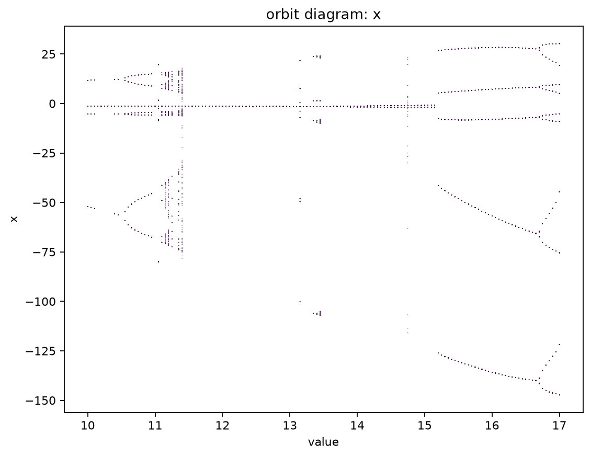
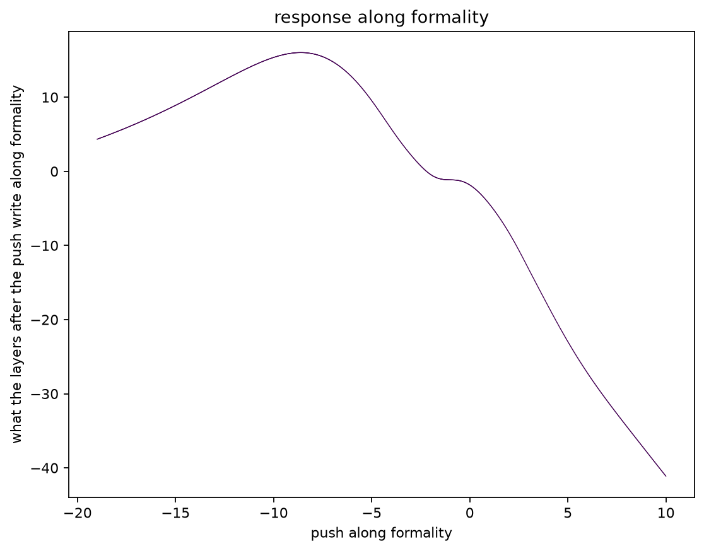

# Experiments

Does Feigenbaum universality apply to LLM feedback loops? The founding document is
[PROJECT.md](PROJECT.md), and [README.md](README.md) says in plain language what has been found.
This file is how to run the code, and every measurement it has made.

## Setup

Everything runs with [uv](https://docs.astral.sh/uv/).

    uv run uni gen "hello"

That one command installs everything and generates from the pinned model. The first run
downloads the checkpoint, about a gigabyte, into the Hugging Face cache. It prints the
text, its sha256, and each generated token with its log-probability.

The model, its revision, dtype, and generation limit are pinned in
[uni/pinned.toml](uni/pinned.toml), and nothing else in the code names them. Generation
runs on Metal, greedy at batch size one; the checkpoint's own sampling settings are
ignored. CPU is too slow for this work, so it is not an option.

## What a run's exit code means

Each code is its own answer rather than a generic failure, because what a reader does
about them differs.

| code | what happened |
|---|---|
| `0` | it did what was asked |
| `1` | the determinism gate ran and some case produced more than one hash |
| `2` | the command line did not parse: a flag this program does not have, or one it needs left out or given no value |
| `70` | a bug in this program: the traceback printed with it says where, and is worth reporting |
| `74` | the machine would not do the work: a full disk, a read-only volume, a path in the way, a checkpoint it cannot fetch |
| `78` | the command parsed, and the run it describes cannot be run: a file, a value, or a combination this program refuses |
| `79` | a sweep ran and some cell of it has no orbit, so it came up short of its grid |
| `141` | something downstream stopped reading, as `uni ... \| head` does — the run was told to stop, not refused |

`78` and `74` are the pair worth telling apart: the first is something you asked for, the
second is something about where you asked it. A loop running unattended can fix a `78` and
try again, while a `74` is not the command's to fix — an outage may clear, a disk will not — and
is where such a loop should stop.

With `--remote` the code is the one `uni` exited with on the host, so the table holds there
too — unless the trip itself fails, and then the code is ssh's or rsync's: `255` from ssh, and
rsync's own codes, one of which is `1`.

## Determinism

Every measurement in this project compares hashes of generated text, so the same input
must produce the same output every time. The gate checks that:

    uv run uni determinism --remote

It generates each case 100 times and prints every run's sha256, then a verdict per
case. It exits 1 if any case produced more than one hash. The cases are an ordinary
prompt, the empty prompt, and a prompt that fills the model's context limit with 16
tokens left over. `--runs` changes the count. A full run takes about 15 minutes, and
it has passed on the run host. Run it again when the model, torch, transformers, or
macOS on the run host changes; nothing else can change the result.

`uv run pytest` checks the same cases with 3 runs each, so the suite stays fast, and
also checks that a fresh process produces the same hash, since the command's runs all
share one process.

Hashes are only comparable within one machine. The run host and a dev Mac agree on
tokens and hashes but differ in the sixth decimal of the log-probabilities.

`tests/test_determinism.py` also holds a negative test, which shows the failure the
gate protects against. The same prompt, batched with a longer request and left-padded
with positions counted from the mask, gives log-probabilities that differ from batch
size one by up to about 1e-4. The greedy text survives that on a short prompt, but in
a long feedback loop a near-tie flips a token, and one flipped token turns an orbit
into noise. That is why the wrapper generates at batch size one and has no batch
setting.

## The loop

A template turns a state into a prompt, and the model's reply is the next state. Feeding
the reply back in, step after step, makes the model an iterated map:

    uv run uni loop --template rewrite --steps 20 --start "The lighthouse keeper climbed the stairs."

It prints the start as step 0 and every state after it, one per line, then writes the
trajectory to `trajectories/<name>.json` and prints the path. The file holds the start,
every state, the knob value, the template's text, and the pinned config, so the run can
be reproduced from the file alone. The name is a hash of those inputs and the step
count. Rerunning the same command rewrites the same file with the same bytes. With
`--remote` the file is written on the run host. The sync neither sends nor deletes
`trajectories/`, so each machine keeps its own. The directory is also gitignored.

The templates live in [uni/templates.toml](uni/templates.toml), each holding `{state}`
exactly once. `identity` asks for the state back unchanged, `empty` sends the state as
the whole prompt, `rewrite` asks for a rewrite, and `summarize` for a summary. The start may be
empty.

`--map` chooses which map is iterated, and defaults to the model. Whichever it is, the runner
only ever calls `step(state)` on it, so nothing below the command line knows there is more than
one. `--value` is that map's parameter: the knob's setting for the model, r for the logistic map
below, and the gain for the response map further down. Each map reads the flags that describe it
and refuses the rest, so a `--knob` carried over from a model run does not ride along unapplied on
an orbit of numbers.

## The logistic map

    uv run uni loop --map logistic --start 0.5 --steps 400 --value 3.5

`x -> r x (1 - x)`, the textbook map, iterated by the same runner, written to the same kind of
trajectory file, and read by the same `uni observe`. It is here because it is the one map whose
answer is known before the code runs: Feigenbaum's period doubling was published for it in 1978,
so an orbit of it is the fixture where a wrong answer is visible as a wrong answer rather than as
a result. Every brick in this repo has it as a second consumer, which is what keeps the bricks
from being shaped around the model.

    r = 2.8   period 1     r = 3.5   period 4     r = 3.9   no period in 1000 steps
    r = 3.2   period 2     r = 3.55  period 8

Those are what `uni observe` reports, exactly, on orbits from `--start 0.5`, given enough steps
to pass the transient and then close the cycle once: 155 at r = 2.8, 35 at 3.2, 33 at 3.5, and
289 at 3.55. The transient lengthens as the cascade goes on, so 2.8 is the slow one only until
3.55 overtakes it, and `--steps 400` covers every row that has a period. The r = 3.9 row is a
claim about a thousand steps and takes a thousand. Too few steps is not a wrong
answer — `uni observe` says it found no period in the steps it was given, and means it.

The orbit is periodic in the strict sense and not merely close to it: float64 lands on the cycle
and stays there, so the detector's exactness reports it with nothing rounded to help.

The states are text, like every other map's. A logistic state is the shortest text that reads
back as exactly its float, and a second spelling of a number the map holds is refused rather than
read: `--start 0.50` is told to write `0.5`. The detector compares the states themselves while the
`x` column compares their numbers, so a spelling the map would never write is one state to the
plot and two to the verdict — a fixed point reported as a transient it never had.

r is refused outside 0..4 and a state outside 0..1, which is not fussiness either: outside them
the orbit runs to -inf and then to nan, and a run of nans is a state that repeats, which a
detector would report as period 1. r has no default for the same reason — 0 is a legal r whose
orbit collapses to zero, so a forgotten `--value` would be answered `period 1` rather than asked
about.

This map costs no checkpoint. `uni loop --map logistic` imports no torch at all, refusals
included, which a test holds to.

## The steering knob

A knob is a number turned on the loop. The first one steers the model: it adds the
value times a fixed direction to the residual stream leaving one decoder layer, at every
position of every step.

    uv run uni loop --template rewrite --steps 20 --start "..." --knob formality --value 2

`--knob` names a direction in [uni/directions](uni/directions), or `none`; left off, the model
map runs unturned. `--value` defaults to 0 for this map, and at 0 the orbit is exactly the
unsteered one. Positive values
push the rewrites toward the direction's quality and negative values push away from it.
At layer 12, `formality` makes the rewrites clearly more formal by 2 and casual by -2. By
4 the rewrites drift away from the text they started from, and they keep drifting: a value
in the millions still generates, it just generates nothing worth reading. Only a value
large enough to stop the logits being numbers at all is refused, at the step it happens,
rather than written down as an orbit of real text. A value with no knob to turn is refused
before the checkpoint is read, rather than recorded as if it had steered.

A direction comes from a contrast, `uni/directions/<name>.toml`. A contrast is a
template, a layer, and pairs of replies to the same text, one toward the quality and
one away from it. Each reply is read as the model's own answer to the template, and the
direction is the mean over pairs of the difference in the layer's residual stream,
averaged over the reply's tokens. Derive it once:

    uv run uni direction formality

This writes `uni/directions/formality.json`, which holds the vector, a copy of the
contrast that produced it, and the checkpoint it was read from, and is committed. Every
trajectory steered by it records the direction's name, layer, and sha256, which is the
hash of the file itself: a direction file that has been edited by hand, or derived on a
different checkpoint than the one pinned, is refused. Re-derive when the contrast or the
checkpoint changes.

## Sweeps

One map run at every value on a grid, from every start, kept together:

    uv run uni sweep --remote --map logistic --grid 2.8:4.0:200 --start 0.5 --steps 400

`--grid FROM:TO:COUNT` names the values, `TO` included, and the ends are exactly the numbers
asked for rather than what the arithmetic lands near — a sweep to r = 4 is a sweep to the edge of
the logistic map's range, and one ulp past it is a cell the map refuses. `--start` is repeated
once per start. Everything else means what it means for `uni loop`.

`--starts NAME` runs a whole set of starts from [uni/starts.toml](uni/starts.toml): a passage cut
after each of a list of word counts, so the starts spread over how long a state is rather than
sitting wherever one typed sentence happens to. It can be repeated, and mixed with `--start`; the
typed starts come first, then each set in the order named. The sweep is named for the starts
themselves, so a set and the same starts typed out are one sweep, and editing a set is a new one.

A sweep runs each cell exactly once, so a grid or a set of starts that names one twice is refused
rather than run twice into one file, and so is a grid the map cannot take — every value is offered
to the map and to the knob before the first cell runs, because a sweep that dies two hundred cells
in dies again on every resume.

Two failures those checks cannot cover, both because a model's states are its own replies. A
state can grow until the rendered state leaves no room to generate, and a reply can fail to end
within the pinned `generation.max_new_tokens`, or within what room the context has left — which a
map refuses, because a reply a limit cut off is not the model's reply, and names the limit. Whether step 300 does either is knowable only by running to step
300. So a cell the map refuses **partway through its orbit** does not stop the sweep. The run says
so on that cell's line, carries on to the cells after it — which are
separate runs of a separate map, with nothing wrong with them — names every refused cell again at
the end, and exits non-zero. Nothing is written for a cell with no orbit: a sweep directory holds
trajectories and nothing else, so the cell simply stays pending and the next run tries it again,
which is what you want the moment whatever refused it is fixed. Were the failure recorded instead,
the cell would be marked done by a run that did not do it, and nothing would ever go back for it.

What makes that a statement about the cell rather than about the sweep is *what* was refused, not
how far the orbit got. A steering direction's layer, and the length of its vector, are fixed by
the direction and not by the setting, so an addition the checkpoint cannot take is one no cell
could have taken: the family is asked for a map before the manifest is written, so that sweep is
refused whole, with no token generated and no directory left behind to fill. A map that comes back
set to a value other than the one it was asked for says the same kind of thing about every cell,
but is found only by running one, so it stops the run where it is found. How early the orbit
stopped would be the wrong test for the same thing, because residual additions large enough to
overflow the model's arithmetic also refuse the first token, and *that* is a property of the
value the cell runs at.

Two things a refused cell does not get, and both are deliberate. It is not remembered: a rerun
runs it again, pays for its orbit again, and is refused again, so an unattended resume loop does
not converge — read the exit code, which is `79` when a sweep ran and came up short, distinct from
the `78` that says the command itself cannot be run. The two do not add up: a run that refused
some cells and was then stopped outright exits with whatever stopped it — `78`, `74`, or `141` —
because what ended it outranks how far it got, and its refusals are on stderr rather than in the
code. And the states it did produce are thrown away rather than written under their own shorter
name, which would put a file in the directory this sweep never named and no rerun would ever look
for. Both are the price of a sweep directory that holds finished orbits and nothing else;
`universality-sweep-81g` carries the question of whether a sweep should be able to say "tried and
cannot" somewhere.

The sweep writes `sweeps/<name>/`: one trajectory per cell, in the same format `uni loop` writes
and `uni observe` reads, beside a `sweep.json` naming the map, the values, the starts, and the
step count. The directory is a hash of exactly those, so rerunning the same command resumes the
same sweep, and changing any of them starts a different one.

It is resumable, and by construction rather than by bookkeeping. A trajectory's file name is a
hash of what fixes the orbit, all of which is known before the cell is run, so a cell is done
when its file is on disk — and `uni loop` already writes each file under a temporary name and
renames it into place, so a run killed part way leaves no half-written cell to mistake for a
finished one. The manifest records what the sweep *is* and never what it has finished: a count of
progress kept beside the files would be a second thing to believe, free to disagree with them.

    uv run uni sweep --remote --map logistic --grid 2.8:4.0:200 --start 0.5 --steps 400 --status

The same command with `--status` says how many cells are done and runs none of them — and writes
nothing, not even the sweep's own directory: a question that left something behind would be an
answer that had changed what it just measured. It costs no checkpoint either, because a map family
holds the pinned configuration rather than a loaded model and reads the checkpoint only when a
cell is actually run. A sweep is identified by what it is, so there is no way to ask about one you
cannot describe.

Sweeps are kept where trajectories are: written on the machine that ran them, gitignored, and
excluded from the `--remote` sync — which runs one way, this tree to the host, with `--delete`. So
a local sweep is never pushed and the host's own is never deleted, and each machine keeps its own.

## Observables and the period

A trajectory is read back from its file rather than re-run, so an observable thought of today
can be asked of an orbit recorded months ago:

    uv run uni observe trajectories/<name>.json

It prints the period first, which is read off the states alone and needs no model, and then one
row per step: a number for the state, then each observable. The state numbers count distinct
states in the order they first appeared, so a period-2 orbit reads `1 2 1 2` straight down the
column. Step 0 is the start, which was given rather than stepped into, so its row carries a
number and no readings.

What an orbit can be read for is decided by what its states are made of, so the columns differ
by map and nothing printing them asks which map it was. The character length of the state is the
one every map answers. An orbit of numbers is read for the numbers, under the column `x` — there
is nothing to derive, and the return map of such a map is the map itself drawn. A model's orbit
is read for the mean log-probability the model gives
the state it wrote (mean, not total, so it is not length under another name), and, for a run that
was steered, how far the state sits along the direction that steered it. The log-probability is
read with the knob at the setting the run recorded: the same model turned elsewhere is another
model, and scores the state differently. The projection is read with the knob off, because it is
read at the layer the knob writes to, and reading through the knob would add the same vector at
every step — a constant that says nothing about the state. An orbit written on a checkpoint other
than the one pinned now is refused, as is a direction that has changed since it steered the run:
every reading is in the units of the weights it was taken under.

The period is exact rather than estimated. The orbit of a deterministic map is exact about this: if a state comes back,
the state after it is the same state as last time, and so is every state after that, forever.
So one repeat fixes both numbers at once, and no window width or count of confirming cycles
enters into it. That the model's map is deterministic is what `uni determinism` establishes.

There are three things the detector can say, and only one of them carries a number:

- `period P, entered at step N` — the orbit came back and kept coming back for the rest of
  the data. Step 0 is the start, as `uni loop` prints it, so `N` also says how long the
  transient was.
- `no period: N steps examined and no state repeated, so any period is at least N` — nothing
  came back. At least, not longer: showing a period of P takes P + 1 states, so a window of N
  that shows no repeat leaves a period of exactly N standing. The detector will not guess which.
- `the state at step N came back P steps later, but step M is not the state P steps before it`
  — the orbit came back and then left the cycle, naming the step that broke it. That cannot
  happen to a map that is a function of its state, so it is reported as its own answer rather
  than filed as "no period", and it means `uni determinism` should be run before anything is
  read into the orbit.

`--burn-in N` passes over the first N steps before looking, for when an early transient is
already known and not wanted. It is rarely needed: the detector reports where the cycle began,
which is the same fact measured rather than assumed.

## The two pictures

    uv run uni plot sweeps/<name> --observable x --burn-in 200

Reads a persisted sweep and writes two figures under `figures/`. Nothing about either one asks
which map ran. The **return map** is the observable's sequence plotted against itself one step
later, which for a map whose states are numbers is the map itself drawn. The **orbit diagram** is
the same readings against the value they were taken at, which is the picture PROJECT.md's Rung 1
is about: period doubling is branches splitting as the value grows.

Both are the same kind of value — points with an x, a y, and a number that colours them — so
there is one drawing function rather than two to keep in step. The return map is coloured by the
value each orbit ran at, so a sweep of one value is one colour and a grid is a fan of them. The
orbit diagram is one colour, because the value is already its x axis.

`--burn-in N` keeps each cell from step N onward, which is where a picture wants a settled orbit
and not the transient that got there. It means exactly what it means to `uni observe`, which
counts the start as step 0 - so a period read off one command and a picture drawn by the other are
about the same states. Nothing has a reading for the start, so `--burn-in 0` and `--burn-in 1`
draw the same picture. A sweep that is still running is drawn from the cells
that are on disk, which is the point of persisting them one at a time; a sweep with nothing on
disk, or a burn-in that ate every step, is refused rather than written as an empty figure that
looks like an answer.

The figure files are named for what fixes the picture - the sweep, the observable, the burn-in -
so a picture says what it is of, and drawing the same sweep another way puts a new file beside the
old one rather than over it.

### The logistic cascade

    uv run uni sweep --map logistic --grid 2.5:4.0:600 --start 0.2 --start 0.7 --steps 400
    uv run uni plot sweeps/e84d01205c88ec92 --observable x --burn-in 200

This is the reference picture, and it is the textbook one. The single branch to r = 3; the first
split exactly at 3.0; the second at about 3.449; the third at about 3.544; the branches crowding
into the accumulation near 3.5699 and then the chaotic band; and inside the band the period-3
window at about 3.83, with its own miniature cascade. The start is 0.2 and 0.7 rather than 0.5,
because 0.5 is exactly the pre-image of the map's maximum: at r = 4 it lands on 1.0 and then on
0.0, and the whole right-hand edge of the picture would be a single dot at zero.

The return map of the same sweep is the family of parabolas, one per r, fanning up to the r = 4
one that touches 1.0. PROJECT.md asks of Rung 1 whether the return map has one smooth hump,
because that is the property the whole theory rests on. For this map it does, by construction —
which is what makes the logistic map the fixture: a wrong answer here is visible as a wrong
answer rather than as a result.

### The rewrite loop over the steering coefficient

The same two pictures for the map this project is actually about: the model rewriting its own
output, with the formality direction added to the residual stream at layer 12, swept over the
coefficient.

    uv run uni sweep --remote --map model --template rewrite --knob formality \
        --grid=-6:6:25 --start "The meeting moved to Thursday because the room was booked." --steps 30
    uv run uni fetch 37e340c190aad178
    uv run uni plot sweeps/37e340c190aad178 --observable along:formality --burn-in 10

The middle line is not decoration. The sweep ran on the host and its cells stay there - `sweeps/`
is excluded from the sync, and the sync has no leg coming back - so the directory has to be
brought home before anything here can draw it. Plotting is a local command by design: a figure
is an output this repo commits, and drawing one on the host puts it where no commit can reach
it, which is also why `figures/` is excluded from the sync rather than deleted by it. `uni plot
--remote` is refused for the same reason rather than left to draw somewhere unreachable and exit
0 - it is the one command that says where its answer lands. The sweep's name is the same on both
machines, because it is the hash of what the sweep is.

`uni fetch NAME` runs here and reaches the host itself, so it takes no `--remote`. It copies the
sweep's directory from the host into `sweeps/NAME/`, adding the cells not here and leaving the
ones that are, and then says how much of the sweep is here, as `uni sweep --status` does. A cell is
a file written whole and named by what fixed it, so a fetch cut short is finished by running it
again, and one run while the sweep is still going on the host brings home what it has so far.

**Only the middle of that grid is a map.** The sweep exits `79`, with 10 of its 25 cells written:
every coefficient from -2.5 to 2.0. At -3.0 and below, and at 2.5 and above, the model's reply to
its own rewrite does not end within the pinned 256 new tokens, and a reply the budget cut off is
not a state of this map, so those cells are refused rather than recorded. What fills the budget
there is not a long answer a larger budget would finish: at -3.0 it is "Cause the room was
booked!" repeated until the budget stops it, and at +6.0 a slide into or-chains and then into
repeating boilerplate in another language. The edge is sharp, too. The longest reply at 2.0 is 24
tokens, and at 2.5 every one is cut.

An earlier run of this sweep kept those cuts as states, and 446 of its 750 states sat on the
budget; its pictures showed wings that measured the ceiling. A trajectory now records that cut
replies are refused, so that run's orbits are not taken for this map's. The 10 cells both runs
wrote are identical, state for state.

The knob works. Where the settled state sits along the formality direction rises from about 1.0
at a coefficient of -2.5 to about 4.6 at 1.5, which is the knob doing what a knob should. At 2.0,
the last coefficient before replies stop ending, it falls back to 3.9.

What the picture does not show is a cascade. The periods are measured rather than eyeballed —
`uni observe` reports each one — and across the 10 cells they are 6 fixed points, a period 2 at
-0.5, 1.0 and 1.5, and a period 3 at 0.5. The cycles longer than one sit around the unsteered
point, not in a doubling sequence, and 0.5 apart on the knob is far too coarse a grid to call any
of it a bifurcation.

The return map says the same thing: the fixed points lie on the diagonal, and each cycle is a
handful of points mirrored across it. Rung 1 of PROJECT.md asks whether this map has one smooth
hump, because that is the shape the whole theory rests on. This is not that shape. A hump needs
states that move.

Read for the character length of the state instead, the sweep shows what the knob does to this
loop on the way to the edge. The informal side settles on one short sentence of 58 characters,
and on the formal side the settled state grows to 143 characters at 2.0, just before replies
stop ending at all.

What this sweep settles is therefore narrow and worth stating plainly: at this template, this
direction, this start, this step count and this resolution, the rewrite loop does not period
double where it is defined, which is between -2.5 and 2.0. It converges or cycles near zero.
Whether a finer grid inside that range, a longer run, more starts, or another knob would show
anything else is the next question, and it is the question Rung 1 exists to ask.

### The loops from many starts: is there a hump?

A sweep from one start shows where that start's orbit settles and nothing about the map around
it. Rung 1 asks for the map's shape, and a map's shape is only drawn where there are states, so
these sweeps hold the knob still and spread the starts instead: the two start sets, each a passage
cut at 1, 2, 3, 5, 8, 12, 18, 27, 40, 60, 90 and 130 words, 24 starts from 3 to 830 characters.

    uv run uni sweep --template summarize --knob none --grid 0:0:1 --starts harbor --starts memo --steps 6
    uv run uni plot sweeps/2ec2ab48ac42aa38 --observable length --burn-in 0
    uv run uni sweep --template rewrite --knob none --grid 0:0:1 --starts harbor --starts memo --steps 6
    uv run uni plot sweeps/d118c0eae9b434f2 --observable length --burn-in 0

**Summarize has no hump, and no one fixed point either.** Every one of its 23 orbits is a fixed
point by step 3, exactly - the same text, byte for byte, from then on - and 20 of them by step 2.
They are 23 *different* fixed points: no two starts settle on the same text, and their lengths run
from 114 to 1151 characters. The one cell refused is the memo cut at 12 words, whose summary does
not end within the 256-token budget. So the return map is the diagonal with a few transient
points off it, which is what a map looks like when nearly every state it writes is one it will
write again: a summary of a summary, to this model under greedy decoding, is the same summary.

**Rewrite is the same with a little more motion.** Of its 24 orbits, 18 are fixed points within
four steps - again 18 different ones, none shared - four are period 2 by step 4, and two have not
repeated in six steps. Its return map stays near the diagonal. The map draws the model's own
states, from step 1 on, and among those no step moves one of 60 characters or more by more than
37% (94 to 129, on its way to a fixed point); the one point far from the diagonal, 44 to 170,
belongs to a 28-character start that has still not settled at step 6. The first rewrite of a
start is another matter - the 12-word harbor start goes from 64 characters to 615 - which is the
model deciding what the text is, once.

Turning the knob does not change that. The same 24 starts under the formality direction, at five
coefficients inside the range where replies end:

    uv run uni sweep --template rewrite --knob formality --grid=-2:2:5 --starts harbor --starts memo --steps 6
    uv run uni plot sweeps/5417892e26309123 --observable along:formality --burn-in 0

| coefficient | written | refused | fixed points (all distinct) | period 2 | no repeat in 6 steps |
|---:|---:|---:|---:|---:|---:|
| -2.0 | 21 | 3 | 21 | 0 | 0 |
| -1.0 | 22 | 2 | 22 | 0 | 0 |
| 0.0 | 24 | 0 | 18 | 4 | 2 |
| 1.0 | 23 | 1 | 15 | 1 | 7 |
| 2.0 | 10 | 14 | 9 | 0 | 1 |

The sweep exits `79` with 100 of 120 cells written; every refusal is a reply that did not end
within the budget. The row at 0.0 is the unsteered sweep above over again, all 24 orbits text for
text, which is what adding zero times a direction should be. At every coefficient each start
that settles settles on a fixed point of its own, and no two starts share one: 85 fixed points,
84 different texts, because one start - the memo's first three words, "Following the review" -
is left exactly as it is at both 0.0 and 1.0. Steering toward
formal makes the orbits restless, seven of 23 still moving at step 6 at 1.0, but restless along
the diagonal rather than onto a common attractor.

Read along the direction that steers it, the return map is a band on the diagonal from -8 to 7,
tight where the coefficient is negative and loosening above 2 where the formal coefficients spread
it. There is no hump in it anywhere.

This is a result about the structure the theory needs, and it is negative. Period doubling is a
single attracting fixed point losing stability as a knob turns - its slope in the return map
passing through -1. These loops do not have a single attracting fixed point to lose. Each start
lands on a fixed point of its own within a step or two, so the set of fixed points is as large as
the set of starts, the slope along it is +1, and there is no hump for a slope to steepen on. A
content-preserving instruction under greedy decoding is close to idempotent: the model's first
answer is already the answer it would give to itself, steered or not.

What it points to is a loop that forgets where it started, which a loop carrying the whole text
forward cannot: a state small enough that the map is a smooth function of one number, as
PROJECT.md's continuous version of the loop has it. That is what the next section measures.

### A push and the model's answer to it: the hump

    uv run uni response --template rewrite --knob formality \
        --start "The meeting moved to Thursday because the room was booked." \
        --grid=-40:40:321 --layer 12 --layer 14 --layer 16 --layer 18 --layer 20 --layer 23

Here the state is a number rather than a text. The prompt is rendered once; the residual stream
leaving layer 12 is pushed by that number times the formality direction; and the reading is how
far the stream sits along the same direction at a later layer, averaged over the prompt, with no
token generated. Nothing is sampled, so the reading is a smooth function of the push - which no
number read off greedy text is, since the text holds still until one token overtakes another.

The push itself is taken back out of the reading. The residual connections carry it to every
later layer, so the stream's own projection is the push read back, 8.96 times the push (the
direction's squared length), a straight line whatever the model does. What is left is what the
layers after the push wrote in answer to it, and it is what `uni response` prints and draws.

The push is taken out token by token, before the average, and a push too large to take out is
refused rather than read. Every addition the stream makes while it holds the push rounds at the
push's size, so a large enough push rounds the model's writes out of the stream, and what is left
reads as a model that answers nothing. The command bounds that rounding from the push alone
before it runs a forward pass, refuses any cell it could move by a hundredth or more, and prints
the worst bound over the grid: 0.00051 for the run above, where a push of 1e12 would be 1.3e7.
Like `uni plot`, it runs here and refuses `--remote`: the figure it draws, and the curves it writes
to `curves/` (see the smooth fit below), would stay on the host.

At layer 12 there is no answer - the curve is flat at -4.3035, float jitter aside, because
nothing after the push has run, which is also the check that the reading holds the push at all.
From layer 14 on the answer has a **hump**: pushed informal, the layers push back toward formal,
most strongly near -8.5; pushed further, less; pushed formal, they push back hard toward informal.
By layer 23, the last one, the curve changes direction exactly once on the 321-point grid, at a
maximum of 16.01 at -8.5, and falls on both sides all the way to -40 and 40. Layers 18 and 20 add
a small dip between -3 and 0, which layer 23 has smoothed into a shoulder.

Feigenbaum's 4.669 belongs to maps whose maximum is quadratic; a quartic top has its own constant,
about 7.28. On 97 points across -14.5 to -2.5, layer 23's top sits at -8.625, and a quartic fit
there gives a squared coefficient of -0.43, -0.40 and -0.40 on windows of 6, 4 and 2 either side,
against a fourth-power coefficient of 0.002 to 0.004. Within 2 of the top a parabola alone fits
to an rms of 0.05 on a range of 1.87, and how fast the curve falls away from the top goes as the
distance to the power 1.75 on the left and 2.09 on the right. The top is quadratic.

This is Rung 1 met, for a loop of this kind: one smooth maximum, of the order the theory needs. It
is a map in waiting rather than a loop yet - closing it means turning the answer back into the
next push, with a gain to turn, and finding the fixed point and its first flip, which is Rung 2.

### The loop closed: a gain, a fixed point, and the first flip

    uv run uni loop --map response --template rewrite --knob formality \
        --text "The meeting moved to Thursday because the room was booked." \
        --layer 23 --value 3 --start=-8.5000 --steps 40

`--map response` turns the answer back into the next push. The state is the push x. One step reads
the answer r(x) exactly as `uni response` does, and the next push is `gain * r(x) / |v|^2`, where
the gain is `--value`. Dividing by the direction's squared length, 8.96, puts the answer in the
units of the push, since a push of x reads back as x |v|^2 along the direction. So at gain 1 the
next push is exactly the push the answer amounts to, and the gain is PROJECT.md's feedback gain
made literal: how much of the answer is fed back. `uni sweep --map response` sweeps the gain.

The state is the push written to four decimals, `-8.5000` and not `-8.5`, and a start spelled any
other way is refused with the spelling to use. A push held to every bit of a float64 is more than
the model can tell apart: the answer is float32, and so is the push on its way into the stream.
Measured at gains 1 to 12, a settled orbit's float64 states spread over 2e-7 to 7e-6, and the
detector counted that spread as cycles of three and six and as real periods doubled. Four decimals
is fourteen times the widest spread. Even so, near an attractor an orbit can flicker between two
neighbouring spellings, a cycle whose points are 0.0001 to 0.0007 apart, which the exact detector
reports as a period. Such a period is not one this section counts; the orbit diagrams and the
slope below do not see it.

    uv run uni fixed --map response --template rewrite --knob formality \
        --text "The meeting moved to Thursday because the room was booked." \
        --layer 23 --grid 1:20:20 --bracket=-3:0 --step 0.05

`uni fixed` answers Rung 2 off the map itself rather than off an orbit. At each value it bisects
for the state the map carries least far, between two states it carries in opposite directions,
and reads the map's slope there across the states `--step` either side. A fixed point gives way
to a period-2 orbit exactly where that slope passes through -1. On the logistic map it returns
x* = 1 - 1/r and a slope of 2 - r to the last digit, and the crossing at r = 3.

The response map has one fixed point between -3 and 0 at every positive gain, and it moves from
-0.18 at gain 1 to -1.76 at gain 20. Its slope is -0.14 at gain 1, never steeper than -0.25 up to
gain 10, and then it falls: -0.61 at 12, -1.10 at 14, -2.72 at 20. It passes through -1 at gain
**13.59**. On a grid of 0.02 across 13.4 to 13.8 the crossing lands at 13.60, 13.60 and 13.58 for
steps of 0.02, 0.05 and 0.1. A four-decimal state makes the slope uncertain by 0.005, and the slope
changes by 0.25 per unit of gain there, so mu_1 = 13.59 +- 0.02. It never passes through +1: the
fixed point is not born or destroyed on this range, only destabilised.

The orbits split where that slope says they should. Swept across it from two starts, beside the
fixed point (-1.5000) and at the top of the hump (-8.5000):

    uv run uni sweep --map response --template rewrite --knob formality \
        --text "The meeting moved to Thursday because the room was booked." \
        --layer 23 --grid 10:17:141 --start=-1.5000 --start=-8.5000 --steps 400
    uv run uni plot sweeps/919bbadcb5408a3a --observable x --burn-in 200

From beside the fixed point, the orbit settles on it up to gain 13.35. From 13.65 on it alternates
between two pushes either side of where the fixed point was: -1.63 and -1.41 at gain 13.7, -1.74
and -1.27 at 14, -1.93 and -0.91 at 15. The gap between them grows as the square root of the
distance past the flip, which is how a period-2 orbit born in a flip grows: the gap squared is a
straight line in the gain, 0.62 per unit with an rms of 0.006 from 13.65 to 14.5. Fitted from 13.65
to 13.8 or to 14.0 that line reaches zero at 13.61, which drifts up to 13.63 as the fit is taken
out to 14.5, where the next order starts to show. The slope put the flip at 13.59 +- 0.02. The
cells at 13.4 to 13.6 hold gaps of 0.001 to 0.03, orbits still creeping toward a fixed point
whose slope is nearly -1 after 200 steps, and gaps under 0.001 elsewhere are the flicker described
above.

Between 15.15 and 15.2 that small orbit is gone, and both starts land on a period-5 orbit 150 wide,
from -126 to 27, each of whose five points splits in two between 16.6 and 16.8. From the top of
the hump, below gain 11.45, the orbit mostly reaches a large orbit of its own rather than the fixed
point: period 3, near 12, -5 and -52, doubled to period 6 by 10.6 and repeating nothing within
200 steps by 11.1. At 13.15, 13.35 to 13.45 and 14.75 it reaches other large orbits too, which are
the stray columns in the picture.

That flip is not the first thing this loop does, though. Swept from 1.5 to 6 from two starts, the
top of the hump (-8.5000) and zero:

    uv run uni sweep --map response --template rewrite --knob formality \
        --text "The meeting moved to Thursday because the room was booked." \
        --layer 23 --grid 1.5:6:181 --start=-8.5000 --start=0.0000 --steps 400
    uv run uni plot sweeps/d503da82b73fe909 --observable x --burn-in 200

The fixed point runs straight through the picture, stable throughout. Beside it, from gain 2.875,
there is a second attractor: a period-2 orbit through the top of the hump, which appears already
12 wide, between 4.8 and -7.0, rather than growing out of anything. At gain 2.85 the orbit from the
top still falls onto the fixed point, and at 2.875 it does not. Its birth is therefore not a flip of
the fixed point, whose slope at that gain is -0.24. The start decides which attractor an orbit
reaches: from zero, every orbit on this range ends at the fixed point.

That second attractor then does exactly what a unimodal map's cascade does. It doubles to period
4 between gains 3.85 and 3.9, where each point has split in two by 0.95, and to period 8 between
4.375 and 4.425, split by 0.36. Just below each doubling the orbit settles slowly, so 200 steps
leave splits of a few thousandths that are not yet the cycle's own. By about 4.55 it no longer
repeats within 200 steps, and between 5.05 and 5.075 it vanishes: from there on, the orbit from
the top falls onto the fixed point too. Measuring those doublings to more than a grid step, and
their ratios against 4.669, is Rung 3, below.

This is Rung 2 met: the fixed point is found, its slope is measured across the gain, and it gives
way at mu_1 = 13.59 +- 0.02, with the orbits splitting where the slope says they must. What this
loop adds to PROJECT.md is a coexisting attractor with its own cascade, reached from the top of the
hump long before the fixed point flips. In one dimension that is the only kind of "different
bifurcation first" there can be.

### The cascade: delta from six superstable gains

An orbit is a poor instrument for a doubling. Just past one it settles slowly, so the cells either
side of 3.875 above hold splits that are not yet the cycle's own, and at four decimals a settled
orbit can still flicker between neighbouring spellings, which an exact detector counts as a period.
So the cascade is read without waiting for anything to settle.

A cycle that passes through the top of the hump, the critical point x_c where the map's slope is
zero, has a multiplier of zero: it is superstable. Each period 2^n of a cascade has one gain where
its cycle is, between that cycle's birth and its own doubling, and the spacings of those gains
shrink by the same ratio as the doublings do. Feigenbaum measured delta that way. At a
superstable gain the orbit from x_c is back at x_c after 2^n steps, so F^p(x_c) - x_c is zero
there, and of opposite signs either side. It is read at a grid of gains around each one, with no
burn-in and no period detected, and a parabola fitted through those readings crosses zero at the
superstable gain. The fit's scatter gives the crossing its error. A parabola and not a line,
because a line cannot follow the curve and misplaces the logistic map's superstable values by
three times the error it reports, where a parabola misplaces them by one.

The starting point x_c is itself a measurement, and an error in it moves every superstable gain by
that error over how steeply F^p(x_c) - x_c crosses zero. The obvious way around that, starting a
step later from the top value F(x_c), does not work: the map is flat at its top, so F(x_c) barely
depends on x_c, but for the same reason F^p(F(x_c)) - F(x_c) only touches zero and never changes
sign. So the top is measured first:

    uv run uni critical --map response --template rewrite --knob formality \
        --text "The meeting moved to Thursday because the room was booked." \
        --layer 23 --decimals 6 --value 20 --grid=-9.1:-8.1:101

`uni critical` fits a cubic to the map over a grid of states, since the hump falls away faster on
one side than the other and would pull a parabola's top toward the gentler side, and finds where
its slope crosses zero. At gains 4.5 and 20, over 61 and 101 states, the top is at -8.61403 +-
0.00002. On the logistic map it finds 0.5.

`--decimals` sets how many decimals the response map writes a push to. The default is four, for the
flicker described above. A superstable gain detects no period, so it can use more: at six, the
readings below scatter three to thirty-five times less than at four, and what is left is the
model's own float32 roughness. The spelling is recorded in every trajectory the map writes.

    uv run uni cascade --map response --template rewrite --knob formality \
        --text "The meeting moved to Thursday because the room was booked." \
        --layer 23 --decimals 6 --critical=-8.614030 --period 2 \
        --grid 3.067:3.075:21 --grid 4.161:4.169:21 --grid 4.4653:4.4673:21 \
        --grid 4.5302:4.5324:21 --grid 4.5442:4.5466:21 --grid 4.5478:4.5491:21

| period | superstable gain | error |
| -----: | ---------------: | ----: |
| 2 | 3.0712744 | 0.0000001 |
| 4 | 4.1657353 | 0.0000021 |
| 8 | 4.4663795 | 0.0000025 |
| 16 | 4.5313866 | 0.0000042 |
| 32 | 4.5454385 | 0.0000050 |
| 64 | 4.5484729 | 0.0000049 |

| spacing ratio over periods | delta_n |
| :------------------------- | ------: |
| 2, 4, 8 | 3.6403855 +- 4.5e-05 |
| 4, 8, 16 | 4.6247912 +- 3.7e-04 |
| 8, 16, 32 | 4.6262033 +- 2.4e-03 |
| 16, 32, 64 | 4.6309232 +- 1.2e-02 |

Starting from -8.613930 instead, five times the top's error away, moves those three ratios by
-0.0019, +0.0056 and -0.0111, so the top's own error adds at most 0.0004, 0.0011 and 0.0022. Grids
twice and half as wide move the ratio over 4, 8, 16 by 0.0008 at most.

The ratios are 4.625, within one percent of 4.6692, which is the target PROJECT.md set for Rung 3,
and nowhere near the 7.28 a quartic top would give. On the logistic map the same command returns
the superstable values to 2e-9 and their ratios 4.6808, 4.6630 and 4.6684. But three ratios in a row
at 4.625, with these errors, are not yet converging on 4.669: they are 0.9% below it and flat. For
the logistic map the ratios at these periods are already within 0.25% of it. This map is not the
logistic map. Its hump falls away unevenly, its answer has the shoulder between -3 and 0 described
above, and a stable fixed point coexists with the cascade. Whether its ratios go on to 4.669 is a question
about doublings past 64, where the float32 roughness of the model's answer swamps the reading: at
period 64 the readings already scatter by 0.0008. The next section follows them past there, on a
smooth fit to the model's own answers.

### Past period 64: the cascade on a smooth fit of the model's answer

The model's answer is read once, finely, and kept:

    uv run uni response --template rewrite --knob formality \
        --start "The meeting moved to Thursday because the room was booked." \
        --grid=-19:10:2901 --layer 23

`uni response` writes every curve it reads to `curves/`, with what it was read from and the
direction's squared length, in a file named by the hash of its own bytes. So this one is
`curves/1bb8e39470dc1a00.json`, committed, and 2901 forward passes are not needed again. It is
named by content and not by the command because the readings are float32 on one device: the same
command elsewhere reads a curve that differs in its last bits, and writes it beside this one
rather than over it.

`uni smooth` fits a Chebyshev series of each degree to the curve by least squares and says how far
the readings lie from it:

    uv run uni smooth --curve curves/1bb8e39470dc1a00.json --layer 23 \
        --degree 60 --degree 90 --degree 150 --degree 220

    curve 1bb8e39470dc1a00 at layer 23: 2901 readings from -19 to 10, jitter 1.35e-05
    degree   60: rms residual 5.52e-04, largest 2.18e-03
    degree   90: rms residual 2.04e-04, largest 6.96e-04
    degree  150: rms residual 1.81e-05, largest 8.94e-05
    degree  220: rms residual 1.41e-05, largest 8.52e-05

The jitter is the readings' own scatter about whatever smooth curve lies under them, read from
their fourth differences: a fourth difference of a smooth curve at a spacing of 0.01 is nothing,
and of independent scatter s it is a number of variance 70 s^2. So a series whose residual comes
down to the jitter has fitted the curve and not yet its noise. Degrees 150 and 220 are there, at
1.3 and 1.05 times it. Degrees 60 and 90 are 41 and 15 times above it, and are here to show what
a coarser fit changes. The fit is numpy's, in Chebyshev polynomials rather than the powers `uni
cascade` fits its parabolas in: on these pushes the powers' normal equations have a condition
number of 3e14 at degree 20 and are singular in a float by 60, where the Chebyshev least-squares
problem has 11 at degree 150. A fit numpy reports as rank deficient is refused.

`--map smooth --curve FILE --layer L --degree D` is the response map with the model's answer
replaced by that series C: a push x goes to `gain * C(x) / |v|^2`, the same division by the same
squared length, so a gain here is a gain there. The state is the push with every bit a float
keeps, since the series has no roughness to lose them in, and a push outside -19 to 10, where the
series was fitted to nothing, is refused rather than extrapolated. The map is recorded by the
curve's name, the layer and the degree; the coefficients are recomputed from those.

Its top is measured as the model's was, on a narrower grid:

    uv run uni critical --map smooth --curve curves/1bb8e39470dc1a00.json --layer 23 \
        --degree 150 --value 4.5 --grid=-8.616:-8.612:51

    the map at 4.5 turns at -8.6140274 +- 2.0e-12 (a cubic through 51 states, scatter 2.6e-15), written -8.614027438063532

The series has no noise, so a cubic's scatter about it is the cubic's failure to follow it, which
shrinks with the grid; on a grid of ±0.025 the top came out 1.8e-9 away, and on grids from ±0.005
to ±0.0005 within 3e-12 of this. That matters far down the cascade. An error e in the top offsets
F^p(x_c) - x_c by e, which moves the superstable gain of period 2^n by e over a slope that grows as
(delta / alpha)^n, while the spacings shrink as delta^-n: relative to its spacing, the gain moves
by about e alpha^n, with alpha = 2.50. From a top 2e-9 off, the ratios over periods 1024 to 4096
and 2048 to 8192 read 4.6691 and 4.6693; from this one, 4.6692 and 4.6692. The same grid gives the
other degrees' tops: -8.61449199320805 (60), -8.613308370166342 (90), -8.61400587604972 (220).
The model's own top, -8.61403 +- 0.00002, is 2.6e-6 from degree 150's and 2.4e-5 from degree 220's.

Each grid below is 21 gains, a fiftieth of the spacing either side of its superstable gain: placed
around the gain a scan found, and past period 1024 around where the spacings extrapolated by delta
put it. A grid that missed its gain would be refused, for crossing zero no times.

    uv run uni cascade --map smooth --curve curves/1bb8e39470dc1a00.json --layer 23 \
        --degree 150 --critical=-8.614027438063532 --period 2 \
        --grid 3.06727:3.07527:21 --grid 4.1438:4.1876:21 --grid 4.46037:4.47239:21 \
        --grid 4.53008:4.53268:21 --grid 4.545166:4.545728:21 --grid 4.5484020:4.5485226:21 \
        --grid 4.5490954:4.5491212:21 --grid 4.54924390:4.54924943:21 \
        --grid 4.549275708:4.549276894:21 --grid 4.549282521:4.549282775:21 \
        --grid 4.5492839804:4.5492840348:21 --grid 4.54928429290:4.54928430454:21 \
        --grid 4.54928435982:4.54928436232:21

The same for degrees 60, 90 and 220

    uv run uni cascade --map smooth --curve curves/1bb8e39470dc1a00.json --layer 23 \
        --degree 60 --critical=-8.61449199320805 --period 2 \
        --grid 3.06732:3.07532:21 --grid 4.1436:4.1874:21 --grid 4.46009:4.47212:21 \
        --grid 4.52974:4.53233:21 --grid 4.544921:4.545487:21 --grid 4.5481901:4.5483120:21 \
        --grid 4.5488910:4.5489172:21 --grid 4.54904120:4.54904679:21 \
        --grid 4.549073356:4.549074554:21 --grid 4.549080244:4.549080500:21 \
        --grid 4.5490817188:4.5490817737:21 --grid 4.54908203471:4.54908204648:21 \
        --grid 4.54908210237:4.54908210489:21

    uv run uni cascade --map smooth --curve curves/1bb8e39470dc1a00.json --layer 23 \
        --degree 90 --critical=-8.613308370166342 --period 2 \
        --grid 3.06712:3.07512:21 --grid 4.1440:4.1878:21 --grid 4.46021:4.47222:21 \
        --grid 4.53010:4.53270:21 --grid 4.545087:4.545646:21 --grid 4.5483203:4.5484408:21 \
        --grid 4.5490142:4.5490400:21 --grid 4.54916282:4.54916836:21 \
        --grid 4.549194666:4.549195853:21 --grid 4.549201487:4.549201741:21 \
        --grid 4.5492029473:4.5492030017:21 --grid 4.54920326013:4.54920327179:21 \
        --grid 4.54920332713:4.54920332963:21

    uv run uni cascade --map smooth --curve curves/1bb8e39470dc1a00.json --layer 23 \
        --degree 220 --critical=-8.61400587604972 --period 2 \
        --grid 3.06727:3.07527:21 --grid 4.1439:4.1876:21 --grid 4.46037:4.47239:21 \
        --grid 4.53008:4.53268:21 --grid 4.545158:4.545720:21 --grid 4.5483975:4.5485182:21 \
        --grid 4.5490916:4.5491174:21 --grid 4.54924023:4.54924577:21 \
        --grid 4.549272073:4.549273259:21 --grid 4.549278892:4.549279146:21 \
        --grid 4.5492803526:4.5492804070:21 --grid 4.54928066538:4.54928067704:21 \
        --grid 4.54928073237:4.54928073487:21

Each runs in about two seconds. Where both reach, the fitted maps' superstable gains beside the
model's, with the model's error:

| period | model, 6 decimals | error | degree 150 | degree 220 | degree 60 |
| -----: | ----------------: | ----: | ---------: | ---------: | --------: |
| 2 | 3.071274395 | 8.4e-08 | 3.071274394 | 3.071270336 | 3.071324269 |
| 4 | 4.165735261 | 2.1e-06 | 4.165734784 | 4.165741152 | 4.165491775 |
| 8 | 4.466379481 | 2.5e-06 | 4.466381728 | 4.466379377 | 4.466103116 |
| 16 | 4.531386572 | 4.2e-06 | 4.531382973 | 4.531382442 | 4.531034549 |
| 32 | 4.545438504 | 5.0e-06 | 4.545446815 | 4.545439132 | 4.545204042 |
| 64 | 4.548472873 | 4.9e-06 | 4.548462265 | 4.548457824 | 4.548251058 |

Degree 150 lands within 2.2 of the model's errors of every one of them, and within 1.1e-5. Degree
220 is within 1.5e-5 and 3.1 errors from period 4 on, but 4.1e-6 off at period 2, where the model's
error is 8e-8: at that precision the fit's own error shows, and no fit to readings with a jitter
of 1.35e-5 is exact. Degree 60, fitted to 41 times the jitter, is 5e-5 to 3.5e-4 off everywhere. And past period
64, where the model can no longer be read, the series goes on:

| spacing ratio over periods | model | degree 60 | degree 90 | degree 150 | degree 220 |
| :------------------------- | ----: | --------: | --------: | ---------: | ---------: |
| 2, 4, 8 | 3.64039 | 3.63981 | 3.64529 | 3.64035 | 3.64049 |
| 4, 8, 16 | 4.6248 | 4.62967 | 4.60757 | 4.62525 | 4.62499 |
| 8, 16, 32 | 4.6262 | 4.58248 | 4.66649 | 4.62187 | 4.62435 |
| 16, 32, 64 | 4.631 | 4.65029 | 4.63459 | 4.66393 | 4.65655 |
| 32, 64, 128 | | 4.66585 | 4.66153 | 4.66768 | 4.66806 |
| 64, 128, 256 | | 4.66829 | 4.66773 | 4.66875 | 4.66882 |
| 128, 256, 512 | | 4.66904 | 4.66888 | 4.66913 | 4.66913 |
| 256, 512, 1024 | | 4.66916 | 4.66913 | 4.66918 | 4.66919 |
| 512, 1024, 2048 | | 4.66919 | 4.66919 | 4.66920 | 4.66920 |
| 1024, 2048, 4096 | | 4.66920 | 4.66920 | 4.66920 | 4.66920 |
| 2048, 4096, 8192 | | 4.66920 | 4.66920 | 4.66920 | 4.66920 |

Every fitted ratio carries an error of 2e-6 to 1.5e-5, from its parabolas. The model's are
4.5e-5, 3.7e-4, 2.4e-3 and 1.2e-2, rounded here to the digits they leave.

Two things are in this table. The first ratios are the shape's. Over periods 8, 16, 32 the four
fits spread from 4.582 to 4.666, and even degrees 150 and 220, both at the jitter, differ by 0.007
over periods 16, 32, 64. The fits at the jitter sit low and flat where the model did, at 4.625
over 4, 8, 16 and 4.622 to 4.624 over 8, 16, 32, so the 0.9% the model's ratios fell short by
there is its hump's own shape and not its roughness. Over 16, 32, 64 the model's 4.6309 +- 0.0120 lies 2.1 and 2.7 errors
below those two fits.

The last ratios are not the shape's. The loosest fit and the closest, whose superstable gains
differ by 2e-4, both reach 4.66920 by period 4096, as the other two do, and over 2048, 4096, 8192
the four read 4.6692031, 4.6692017, 4.6692012 and 4.6692026, within 2e-6 of each other and inside
their errors of 7.5e-6 to 8e-6. Feigenbaum's delta is 4.6692016. On the way there each gap to delta is
about 4.9 times the next (for degree 150: -1.9e-5, -3.9e-6, -8e-7), a steady geometric approach.
This is what universality claims: a constant the map's shape does not set, and here four maps
whose early ratios differ by 2% share it.

What this rests on is that the series is the model's answer. Degree 150 fits the curve to 1.3
times the curve's own jitter and places the model's six measurable superstable gains within 2.2
of their errors, and every degree, however loosely fitted, carries the cascade to the same delta.

### Alpha: the cycles shrink by the same factor

Delta is how the superstable gains close in along the knob. Alpha, the second of Feigenbaum's
constants, is how the cycles themselves close in on the top. At the superstable gain of period p the
orbit of the top x_c is a cycle, and its point nearest the top is the one half a period round:

    d = F^(p/2)(x_c) - x_c

Each doubling brings that point nearer by a factor of 2.5029 and puts it on the other side,
so d_n / d_(n+1) runs to -2.5029, whatever the shape of a quadratic hump.

`uni cascade` reads it from the grids it already holds, since half a period divides the period. It
fits a parabola through the half-period's return on each grid and evaluates it at the superstable
gain. The error is that parabola's own and the gain's error carried along its slope. Each row gains
the nearest point and its error, and a line follows the spacing ratios for each pair of periods:

    nearest-point ratio over periods 2, 4: -2.1673930 +- 4.6e-06

On the logistic map,

    uv run uni cascade --map logistic --critical 0.5 --period 2 --grid 3.2355:3.2365:11 \
        --grid 3.4981:3.4991:11 --grid 3.5544:3.5549:11 --grid 3.56655:3.56675:11 --grid 3.5692:3.5693:11

prints the ratios -2.6547448, -2.5318377, -2.5087183 and -2.5041118. The same distances solved to 40
digits with mpmath, in `tests/test_cascade.py`, give -2.6547448, -2.5318377, -2.5087182 and
-2.5041128: they agree to 1e-6. The commands of
the two sections above print these for the model and its four fits:

| periods | model | degree 60 | degree 90 | degree 150 | degree 220 |
| :------ | ----: | --------: | --------: | ---------: | ---------: |
| 2, 4 | -2.16739 +- 4.6e-06 | -2.16809 | -2.16662 | -2.16739 | -2.16737 |
| 4, 8 | -3.82764 +- 4.2e-05 | -3.82671 | -3.83220 | -3.82763 | -3.82773 |
| 8, 16 | -2.21061 +- 2.0e-04 | -2.21656 | -2.20362 | -2.21064 | -2.21060 |
| 16, 32 | -2.64443 +- 1.4e-03 | -2.63794 | -2.66437 | -2.64529 | -2.64605 |
| 32, 64 | -2.42986 +- 5.8e-03 | -2.45031 | -2.44271 | -2.44933 | -2.44861 |
| 64, 128 | | -2.52445 | -2.52691 | -2.52511 | -2.52510 |
| 128, 256 | | -2.49431 | -2.49322 | -2.49411 | -2.49408 |
| 256, 512 | | -2.50634 | -2.50676 | -2.50644 | -2.50643 |
| 512, 1024 | | -2.50153 | -2.50136 | -2.50150 | -2.50150 |
| 1024, 2048 | | -2.50346 | -2.50352 | -2.50347 | -2.50347 |
| 2048, 4096 | | -2.50269 | -2.50266 | -2.50268 | -2.50268 |
| 4096, 8192 | | -2.50300 | -2.50301 | -2.50300 | -2.50300 |

The fitted ratios carry errors of 2e-7 to 2.7e-6.

The early ratios belong to the shape, as delta's did. They swing from -2.17 to -3.83 and back, where
the logistic map's fall steadily from -2.65. The late ratios belong to no fit in particular. From
period 64 on they alternate about -2.5029, and each one's distance from it is -1/2.47 to -1/2.52
times the one before, for all four fits. Over 2048, 4096 and 4096, 8192 the fits read -2.50266 to
-2.50269 and -2.50300 to -2.50301, which bracket alpha = 2.5029079. Aitken's extrapolation of a
geometric approach, taken on the last three ratios printed (1024, 2048 through 4096, 8192), gives
-2.5029084, -2.5029076, -2.5029077 and -2.5029082 for degrees 60, 90, 150 and 220. That is alpha to
within 5e-7, from ratios printed with errors of about 1e-6, and the extrapolation assumes only that
the approach is geometric, which the steady ratio of the distances shows it is.

The model's own distances and those of the degree-150 fit, from the same commands:

| period | model | error | degree 150 | model - fit |
| -----: | ----: | ----: | ---------: | ----------: |
| 2 | 14.1050843 | 1.8e-07 | 14.1050807 | 3.6e-06 |
| 4 | -6.5078572 | 1.4e-05 | -6.5078541 | -3.1e-06 |
| 8 | 1.7002267 | 1.8e-05 | 1.7002313 | -4.6e-06 |
| 16 | -0.7691226 | 7.0e-05 | -0.7691136 | -9.0e-06 |
| 32 | 0.2908460 | 1.5e-04 | 0.2907482 | 9.8e-05 |
| 64 | -0.1196967 | 2.8e-04 | -0.1187053 | -9.9e-04 |

From period 4 to 32 they agree within 0.65 of the model's errors, and so do the ratios through 16,
32. At period 2 the gap is 20 errors, but d there is a single step from the one push x_c, and
nothing averages the model's roughness at that push. The 3.6e-6 is 1.05e-5 in the model's answer
once the gain and squared length are divided out, which is the size of its jitter.

At period 64 the model's distance is 3.5 of its errors from the fit's, and its ratio over 32, 64 is
3.4 errors from the fit's. The gap is not the grid. The model read on the grid above, on grids twice
and half as wide, and on one twice as dense, gives -0.119697, -0.119346, -0.119618 and -0.119780,
each with errors of 2.3e-4 to 4.5e-4, while every fit at the jitter reads -0.11871. Nor is it the
top: moving the fit's top by the model top's error, 2e-5, either way moves its distance by 4e-5. The
gap grows about tenfold a doubling from period 16, through 9e-6, 9.8e-5 and 9.9e-4. It has two
candidate causes, and these measurements do not tell them apart. One is the model's float32
roughness, about 7e-6 of push a step, which the direct reading carries and the fits remove. The
other is shape the fits miss. The next section measures how noise is carried along these cycles, and finds the roughness
large enough.

The period-64 grids, and the fit from moved tops

    for grid in 4.5478:4.5491:21 4.54717:4.54977:21 4.54815:4.54880:21 4.5478:4.5491:41; do
        uv run uni cascade --map response --template rewrite --knob formality \
            --text "The meeting moved to Thursday because the room was booked." \
            --layer 23 --decimals 6 --critical=-8.614030 --period 64 --grid $grid
    done

    for top in -8.61401 -8.61405; do
        uv run uni cascade --map smooth --curve curves/1bb8e39470dc1a00.json --layer 23 \
            --degree 150 --critical=$top --period 2 \
            --grid 3.06727:3.07527:21 --grid 4.1438:4.1876:21 --grid 4.46037:4.47239:21 \
            --grid 4.53008:4.53268:21 --grid 4.545166:4.545728:21 --grid 4.5484020:4.5485226:21
    done

### Kappa: how much noise each doubling needs removed

Noise truncates a cascade. With noise in every step, the cycles that are smaller than the noise can
no longer be told apart, and the doublings stop being seen at the period where that happens. The
theory's third number, kappa = 6.619, says where: each doubling more needs the noise smaller by
kappa.

It is read off the same superstable cycles. Put noise of unit size into every step of the cycle from
the top. Noise landing at x_k is carried to the cycle's return by the slopes at x_k to x_(p-1), so
the return moves by

    G_p = sqrt(sum over k of (F'(x_k) F'(x_(k+1)) ... F'(x_(p-1)))^2)

its noise gain. From one doubling to the next the gain grows and the cycle shrinks. Measured against
the cycle's own size, the distance d of the last section, the noise's reach grows by (G_2p / G_p)
|d_p / d_2p|, and that runs to kappa. `uni cascade` prints G_p beside the nearest point, through a
parabola across the grid as the distances are, and the growth for each pair of periods:

    noise growth over periods 2, 4: 4.4768900 +- 6.3e-06

It does so for the maps whose slope is exact: the logistic map's, from its formula, and a smooth
map's, from the derivative of its series. The model's own answer has no slope to give. It is float32
and rough at 1e-5, and a difference across that roughness is the roughness's slope.

On the logistic map, on grids a hundredth of a spacing wide and taken to period 8192,

    uv run uni cascade --map logistic --critical 0.5 --period 2 \
        --grid 3.2360494775:3.2360994775:21 --grid 3.49759047256:3.50021540978:21 \
        --grid 3.55443336986:3.5549941615:21 --grid 3.56662288174:3.56674314691:21 \
        --grid 3.56923399988:3.56925976139:21 --grid 3.56979325223:3.56979876985:21 \
        --grid 3.56991302819:3.5699142099:21 --grid 3.56993868059:3.56993893368:21 \
        --grid 3.56994417455:3.56994422876:21 --grid 3.56994535119:3.5699453628:21 \
        --grid 3.56994560319:3.56994560568:21 --grid 3.56994565716:3.56994565769:21 \
        --grid 3.56994566872:3.56994566883:21

the growths are 6.8839698, 6.6606340, 6.6277960, 6.6207460 and 6.6194037 over periods 2 to 64. They
settle at 6.6190372 +- 4.0e-8 over 512, 1024 and 6.6190367 +- 5.4e-7 over 2048, 4096. The same gains
solved to 40 digits with mpmath, in `tests/test_cascade.py`, give 6.8839697, 6.660634, 6.627796 and
6.620746. So kappa, read this way, is 6.619037.

On the four fits of the model's answer, from the commands of the section before last:

| periods | logistic | degree 60 | degree 90 | degree 150 | degree 220 |
| :------ | -------: | --------: | --------: | ---------: | ---------: |
| 2, 4 | 6.88397 | 4.47906 | 4.47391 | 4.47689 | 4.47687 |
| 4, 8 | 6.66063 | 10.05310 | 10.07673 | 10.04598 | 10.04550 |
| 8, 16 | 6.62780 | 5.80916 | 5.79721 | 5.82400 | 5.82383 |
| 16, 32 | 6.62075 | 6.96005 | 7.03265 | 6.99047 | 6.99144 |
| 32, 64 | 6.61940 | 6.47864 | 6.45611 | 6.47688 | 6.47401 |
| 64, 128 | 6.61911 | 6.67539 | 6.68181 | 6.67743 | 6.67717 |
| 128, 256 | 6.61905 | 6.59621 | 6.59325 | 6.59573 | 6.59557 |
| 256, 512 | 6.61904 | 6.62810 | 6.62918 | 6.62836 | 6.62832 |
| 512, 1024 | 6.61904 | 6.61540 | 6.61495 | 6.61531 | 6.61531 |
| 1024, 2048 | 6.61904 | 6.62049 | 6.62066 | 6.62053 | 6.62052 |
| 2048, 4096 | 6.61904 | 6.61846 | 6.61839 | 6.61844 | 6.61844 |
| 4096, 8192 | 6.61904 | 6.61927 | 6.61930 | 6.61927 | 6.61927 |

The fitted growths carry errors of 2.2e-6 to 5.3e-5.

The pattern is alpha's. The early growths belong to the hump: they go 4.48, 10.05, 5.82, 6.99, 6.48
on degree 150, where the logistic map's fall steadily from 6.88. From period 64 on they alternate
about 6.619, and each one's distance from 6.619037 is -1/2.43 to -1/2.54 times the one before, for
all four fits. Over 2048, 4096 and 4096, 8192 they read 6.61839 to 6.61846 and 6.61927 to 6.61930,
either side of the logistic map's 6.619037. Aitken's extrapolation on the last three growths printed
gives 6.6190360, 6.6190362, 6.6190367 and 6.6190361 for degrees 60, 90, 150 and 220: the logistic
map's kappa to within 1.2e-6, from growths printed with errors of about 3e-6.

The noise gain also accounts for what the model's direct readings could not resolve. The curve's
jitter, 1.35e-5 in the answer, is 6.9e-6 of push a step at a gain of 4.55, and the direct cascade's
returns scatter about their parabolas by that jitter carried by the gain:

| period | jitter x gain / squared length x G_p | direct scatter |
| -----: | -----------------------------------: | -------------: |
| 2 | 8.2e-06 | 1.3e-06 |
| 4 | 2.3e-05 | 2.9e-05 |
| 8 | 6.4e-05 | 6.0e-05 |
| 16 | 1.7e-04 | 1.9e-04 |
| 32 | 4.6e-04 | 4.2e-04 |
| 64 | 1.2e-03 | 8.0e-04 |

G_p is the degree-150 fit's, at the model's own superstable gains. From period 4 to 64 the scatter
is 0.66 to 1.27 times the prediction. At period 2 it is 0.16 of it, but there the grid's 21 orbits
all start from the one push x_c and take their second step from pushes within 0.014 of each other,
so most of their roughness is shared and shifts the return instead of scattering it. So the model's
float32 roughness is noise the cascade carries, and at period 64 it moves the return by 1e-3. That
is the size of the gap between the model's d_64 and the fits'. Whether that roughness is what makes
the gap is a question about a bias rather than a scatter. On the noisy map of the next section,
noise independent from one step to the next leaves the mean half-period point where the cycle's is
until its reach is past one, and the roughness reaches 1.2e-3 in a distance of 0.119. So a roughness
that biases d_64 would have to be shared between neighbouring pushes, which is not read here.

### Temperature: how many doublings a drawn token lets through

Every map above reads the model's answer with no token written. A loop that generates draws its
tokens, and the least it can draw is one: the token after the prompt, under the push, drawn at a
temperature T with probability proportional to p^(1/T). The answer is then read over the prompt
and that token together, as `uni response` reads it over the prompt, so it depends on which token
came up. Over the draw it has a mean, which is a map, and a spread, which is noise that map is read
with at every step.

    uv run uni temperature --template rewrite --knob formality \
        --start "The meeting moved to Thursday because the room was booked." \
        --grid=-19:10:291 --layer 23 \
        --temperature 1 --temperature 0.7 --temperature 0.5 --temperature 0.3 \
        --temperature 0.2 --temperature 0.1 --temperature 0.05 --temperature 0.02

reads, at each push, the answer with each of the 151,936 tokens in the vocabulary appended, and
weighs them at each temperature. So the mean and the spread carry no sampling error. That is a
forward pass per token, and it took three hours here. It writes a curve of means and one of
spreads for each temperature:

| T | means | spreads |
| -: | :---- | :------ |
| 1 | `curves/2a1a49bcd3238c74.json` | `curves/16428756a7f5c3a6.json` |
| 0.7 | `curves/0509861b3e600267.json` | `curves/87f60bd9cf796196.json` |
| 0.5 | `curves/d0ad9e1cb35460f9.json` | `curves/36247784fe751616.json` |
| 0.3 | `curves/507a6f83ebd66ffd.json` | `curves/007dac775ef90de2.json` |
| 0.2 | `curves/3b9549a3116a9bf1.json` | `curves/f2932e16848f3c1a.json` |
| 0.1 | `curves/9586920052d4640b.json` | `curves/dd49428b0fab9882.json` |
| 0.05 | `curves/30c1551d63d2bc85.json` | `curves/6b23efc1a2322b3f.json` |
| 0.02 | `curves/edbaf45599bbc1f2.json` | `curves/9387ab2dbfe7bbfd.json` |

The same command with `--remote` read the other sixteen curves in `curves/` on the host, and its
table agrees with this one to every digit printed.

The spread, from the table it prints:

| push | T = 1 | 0.7 | 0.5 | 0.3 | 0.2 | 0.1 | 0.05 | 0.02 |
| ---: | ----: | --: | --: | --: | --: | --: | ---: | ---: |
| -19 | 8.6e-02 | 8.9e-02 | 8.4e-02 | 7.3e-02 | 6.6e-02 | 5.2e-02 | 3.0e-02 | 6.5e-03 |
| -8.6 | 9.9e-02 | 9.4e-02 | 8.4e-02 | 6.6e-02 | 4.7e-02 | 1.1e-02 | 6.6e-04 | 3.4e-07 |
| -3 | 6.5e-02 | 2.7e-02 | 8.8e-03 | 8.4e-04 | 5.2e-05 | 1.4e-08 | 1.1e-15 | 4.8e-37 |
| 0 | 2.7e-02 | 7.9e-03 | 1.6e-03 | 5.0e-05 | 7.8e-07 | 5.4e-12 | 3.7e-22 | 1.3e-52 |
| 5.5 | 5.1e-02 | 1.5e-02 | 5.8e-03 | 1.7e-03 | 3.9e-04 | 4.7e-06 | 6.8e-10 | 2.1e-21 |
| 10 | 9.2e-02 | 4.3e-02 | 1.5e-02 | 1.8e-03 | 1.4e-04 | 6.9e-08 | 2.0e-14 | 6.4e-34 |

It is largest at the top, -8.6, which every superstable cycle passes through. There the next token
is spread thin enough that cooling to 0.2 halves the spread and no more. Where one token dominates,
at 0 and -3, cooling removes it within a few steps of T. And the draw moves the map as well as
spreading it: the mean at the top is 15.9966 at T = 1, 16.0179 at 0.5 and 16.0866 at 0.05, where the
answer with no token is 16.0178.

#### The prediction

A spread s in the answer is noise gain * s / |v|^2 in the next push, and the Kappa section says
how noise at every step is carried to the return. Here its size depends on where it is put in, so
each step's noise is taken at its own push and carried by the slopes after it:

    S_p = sqrt(sum over k of (gain * s(x_k) / |v|^2)^2 (F'(x_(k+1)) ... F'(x_(p-1)))^2)

`uni cascade --noise SPREADS` prints S_p in place of G_p, reading s between the curve's pushes on
the straight line through the two either side, and prints for each period how far it reaches in the
cycle's nearest distance:

    noise over nearest distance at period 8: 2.5053677e-01 +- 9.8e-08

Below one, the noise moves a run's return by less than the cycle's half-period point lies from the
top. Past one it moves it further, and in a single run the doubling can no longer be told from
the noise. Carried along the
cycles of the degree-150 fit, with the grids of the section on it and `--noise` added:

    uv run uni cascade --map smooth --curve curves/1bb8e39470dc1a00.json --layer 23 \
        --degree 150 --critical=-8.614027438063532 --period 2 \
        --grid 3.06727:3.07527:21 --grid 4.1438:4.1876:21 --grid 4.46037:4.47239:21 \
        --grid 4.53008:4.53268:21 --grid 4.545166:4.545728:21 --grid 4.5484020:4.5485226:21 \
        --grid 4.5490954:4.5491212:21 --grid 4.54924390:4.54924943:21 \
        --grid 4.549275708:4.549276894:21 --noise curves/16428756a7f5c3a6.json

and the same with each temperature's spreads:

| T | period 2 | 4 | 8 | 16 | 32 | 64 | 128 | last period below one |
| -: | -------: | -: | -: | -: | -: | -: | --: | --------------------: |
| 1 | 3.7e-03 | 0.023 | 0.25 | 1.48 | 10.4 | 67 | 450 | 8 |
| 0.7 | 3.3e-03 | 0.020 | 0.23 | 1.34 | 9.4 | 61 | 408 | 8 |
| 0.5 | 3.0e-03 | 0.018 | 0.20 | 1.20 | 8.5 | 55 | 367 | 8 |
| 0.3 | 2.3e-03 | 0.015 | 0.17 | 0.97 | 6.9 | 44 | 297 | 16 |
| 0.2 | 1.6e-03 | 0.012 | 0.13 | 0.75 | 5.4 | 35 | 234 | 16 |
| 0.1 | 3.9e-04 | 8.7e-03 | 0.052 | 0.35 | 2.6 | 17 | 115 | 16 |
| 0.05 | 2.2e-05 | 7.9e-03 | 9.0e-03 | 0.078 | 0.64 | 4.3 | 29 | 32 |
| 0.02 | 1.1e-08 | 5.8e-03 | 1.8e-03 | 5.0e-03 | 0.10 | 0.77 | 5.3 | 64 |

Past the period where the reach passes one it grows by about 6.6 a doubling, as kappa says it must,
so cooling lets through a doubling for each factor of 6.6 it takes off the noise the cycle collects.
From T = 1 to 0.02 that is three doublings more, from period 8 to period 64. The early columns
are not monotone at the coldest temperatures. The period-4 cycle's point half a period round is
at -15.1, toward the lowest pushes, where the spread survives cooling longest, and its reach stays
near 6e-3 while period 2's, whose other point is at 5.5, collapses.

#### The check

The prediction is carried along the cycles of a map, and the loop that draws a token runs on its
mean, which is not the map with no token: at T = 1 its superstable gain of period 64 is 4.5098,
against 4.5485 with none. So each temperature is checked on its own mean. `uni smooth` fits the
curves of means as it fits the answer with no token:

| T | jitter | degree 140: rms residual | largest |
| -: | -----: | ----------------------: | ------: |
| 1 | 2.93e-05 | 1.37e-05 | 5.09e-05 |
| 0.7 | 2.96e-05 | 1.41e-05 | 5.09e-05 |
| 0.5 | 3.18e-05 | 1.68e-05 | 6.39e-05 |
| 0.3 | 6.12e-05 | 6.24e-05 | 4.88e-04 |
| 0.2 | 1.48e-04 | 1.54e-04 | 1.43e-03 |
| 0.1 | 4.62e-04 | 3.91e-04 | 4.07e-03 |
| 0.05 | 7.53e-04 | 6.32e-04 | 6.06e-03 |
| 0.02 | 1.05e-03 | 9.15e-04 | 7.01e-03 |

Degree 150 is refused on 291 readings, and a curve read every 0.1 has fourth differences that see
some of its shape, so this jitter overstates its scatter. From T = 1 to 0.5 the fit comes down to
1.4e-5 to 1.7e-5, about the answer's own roughness read every 0.01. Colder, the curve itself
roughens: its jitter grows from 6.1e-5 at 0.3 to 1.05e-3 at 0.02, and the largest miss to 7e-3.
Down to 0.2 the largest miss, 1.4e-3, is 3% of the spread at the top it is checked against. At 0.1
it is 4.1e-3 against a spread there of 1.1e-2, and a map fitted that loosely would test the fit
rather than the noise. So the check is made from T = 1 down to 0.2.

Each mean map's top and superstable gains are found as the smooth map's were:

    uv run uni critical --map smooth --curve curves/2a1a49bcd3238c74.json --layer 23 \
        --degree 140 --value 4.5 --grid=-8.608:-8.588:51

    the map at 4.5 turns at -8.5979469 +- 4.9e-08 (a cubic through 51 states, scatter 3.2e-10), written -8.59794690133104

    uv run uni cascade --map smooth --curve curves/2a1a49bcd3238c74.json --layer 23 \
        --degree 140 --critical=-8.59794690133104 --period 2 \
        --grid 3.06363:3.07163:21 --grid 4.1094:4.1519:21 --grid 4.42299:4.43492:21 \
        --grid 4.49174:4.49430:21 --grid 4.506542:4.507094:21 --grid 4.5097277:4.5098464:21 \
        --noise curves/16428756a7f5c3a6.json

and the others with the grids below. That command is the prediction on the mean map. Its
superstable values are where the check is read:

The tops and grids at 0.7, 0.5, 0.3 and 0.2

| T | means | top grid | top | cascade grids |
| -: | :---- | :------- | :-- | :------------ |
| 0.7 | `0509861b3e600267` | -8.61:-8.59 | -8.599686762143579 | 3.06223:3.07023 4.1049:4.1473 4.41700:4.42888 4.48559:4.48815 4.500339:4.500888 4.5035104:4.5036287 |
| 0.5 | `d0ad9e1cb35460f9` | -8.621:-8.601 | -8.610080566092575 | 3.06292:3.07092 4.1013:4.1435 4.41529:4.42724 4.48352:4.48606 4.498166:4.498712 4.5013150:4.5014324 |
| 0.3 | `507a6f83ebd66ffd` | -8.653:-8.633 | -8.642651123903905 | 3.06643:3.07443 4.0912:4.1329 4.41247:4.42473 4.47807:4.48050 4.492471:4.493009 4.4955928:4.4957093 |
| 0.2 | `3b9549a3116a9bf1` | -8.657:-8.637 | -8.646836247852228 | 3.06499:3.07299 4.0873:4.1288 4.40656:4.41875 4.47017:4.47252 4.484394:4.484927 4.4875143:4.4876308 |

Each top grid is 51 states and each cascade grid 21 gains, with the temperature's spreads as
`--noise`.

Two loops are run at those gains. `--map noisy` is the smooth mean map with a normal draw of the
measured spread added to its answer at each step: noise of the size the prediction assumes and
of no other shape. `--map sampled` is the model itself: the response map with the token after the
prompt drawn at T and the answer read with it, the push written to six decimals. Both take
`--seed`, and their draws are fixed by it, by the gain and by the state, so a run is the same run
when it is repeated. `uni spread` runs the orbit of the top many times at each gain, from seeds
counted up from `--seed`, and prints where the draws land half a period round and after a period,
and how far the spread of the return reaches in the distance of the mean half-period point:

    uv run uni spread --map noisy --curve curves/2a1a49bcd3238c74.json --layer 23 \
        --degree 140 --spreads curves/16428756a7f5c3a6.json --seed 0 \
        --critical=-8.59794690133104 --period 2 --draws 2000 \
        --value 3.067628676 --value 4.130639374 --value 4.428954633 \
        --value 4.49301896 --value 4.506817811 --value 4.509787049

    uv run uni spread --map sampled --template rewrite --knob formality \
        --text "The meeting moved to Thursday because the room was booked." \
        --layer 23 --decimals 6 --temperature 1 --seed 0 \
        --critical=-8.597947 --period 2 --draws 300 \
        --value 3.067628676 --value 4.130639374 --value 4.428954633 \
        --value 4.49301896 --value 4.506817811 --value 4.509787049

The noisy map runs in seconds. The sampled one is two forward passes a step, the prompt's and the
token's, for 37,800 steps at 300 draws, and took from 25 minutes to under an hour a temperature on the machines it ran on.
The other temperatures are the same commands with their curves, tops and superstable values.

The reach, predicted on each mean map by `uni cascade --noise` and measured by `uni spread` on the
two loops, with the measured errors:

| T | period | predicted | noisy, 2000 draws | sampled, 300 draws |
| -: | -----: | --------: | ----------------: | -----------------: |
| 1 | 2 | 3.77e-03 | 3.76e-03 +- 5.9e-05 | 3.41e-03 +- 2.1e-04 |
| | 4 | 0.0234 | 0.0233 +- 3.6e-04 | 0.0235 +- 1.1e-03 |
| | 8 | 0.250 | 0.248 +- 4.2e-03 | 0.251 +- 1.1e-02 |
| | 16 | 1.485 | 1.218 +- 0.027 | 1.116 +- 0.059 |
| 0.7 | 2 | 3.39e-03 | 3.31e-03 +- 5.3e-05 | 3.29e-03 +- 1.9e-04 |
| | 4 | 0.0209 | 0.0206 +- 3.3e-04 | 0.0201 +- 1.1e-03 |
| | 8 | 0.225 | 0.227 +- 3.8e-03 | 0.219 +- 9.5e-03 |
| | 16 | 1.340 | 1.137 +- 0.023 | 1.154 +- 0.063 |
| 0.5 | 2 | 3.00e-03 | 2.97e-03 +- 4.5e-05 | 2.98e-03 +- 1.8e-04 |
| | 4 | 0.0188 | 0.0185 +- 3.0e-04 | 0.0184 +- 1.0e-03 |
| | 8 | 0.200 | 0.196 +- 3.2e-03 | 0.211 +- 1.0e-02 |
| | 16 | 1.207 | 1.027 +- 0.020 | 0.950 +- 0.051 |
| 0.3 | 2 | 2.34e-03 | 2.37e-03 +- 3.9e-05 | 2.24e-03 +- 1.3e-04 |
| | 4 | 0.0160 | 0.0164 +- 2.6e-04 | 0.0151 +- 6.4e-04 |
| | 8 | 0.160 | 0.159 +- 2.5e-03 | 0.149 +- 6.4e-03 |
| | 16 | 1.009 | 0.900 +- 0.017 | 0.884 +- 0.044 |
| 0.2 | 2 | 1.60e-03 | 1.57e-03 +- 2.4e-05 | 1.51e-03 +- 1.4e-04 |
| | 4 | 0.0128 | 0.0127 +- 2.0e-04 | 0.0122 +- 5.6e-04 |
| | 8 | 0.122 | 0.124 +- 1.9e-03 | 0.115 +- 5.8e-03 |
| | 16 | 0.790 | 0.720 +- 0.013 | 0.753 +- 0.040 |

Through period 8, where the reach is at most a quarter, every measurement on either loop lies
within 1.7 of its errors of the prediction. Twelve of the fifteen on the sampled loop lie below it,
by up to 10%. So the token's noise at these temperatures is what its spread says, carried by the
mean map's slopes, and its shape changes that by no more than a few percent the draws can resolve.

At period 16 the prediction runs from 0.79 to 1.49, and both loops fall short of it by up to a
quarter, more the larger it is. A reach near one carries the orbit far enough from the cycle that the
cycle's slopes no longer carry its noise. But where the reach passes one is where it was predicted.
It is past one at T = 1 and 0.7 on both loops, below it at 0.3 and 0.2 on both, and at 0.5, predicted
at 1.21, the two loops read 1.03 and 0.95. Cooling from 1 to 0.2 lets period 16 through, and it
does so between 0.5 and 0.3, where the prediction puts it.

Past one, the reach stops growing. The return's spread settles at 0.8 to 1.3 on every loop, the
width of the band the orbit now wanders in. What is left of the cycle is where the draws land on
average, half a period round, beside the distance the mean map's own cycle puts there:

| T | period | cycle | noisy | sampled |
| -: | -----: | ----: | ----: | ------: |
| 1 | 16 | -0.764 | -0.780 +- 0.013 | -0.803 +- 0.031 |
| | 32 | 0.289 | 0.377 +- 0.024 | 0.302 +- 0.060 |
| | 64 | -0.118 | 0.486 +- 0.028 | 0.482 +- 0.073 |
| 0.7 | 16 | -0.765 | -0.776 +- 0.012 | -0.764 +- 0.032 |
| | 32 | 0.290 | 0.347 +- 0.023 | 0.419 +- 0.057 |
| | 64 | -0.118 | 0.377 +- 0.028 | 0.325 +- 0.072 |
| 0.5 | 16 | -0.766 | -0.787 +- 0.011 | -0.810 +- 0.026 |
| | 32 | 0.291 | 0.378 +- 0.021 | 0.388 +- 0.053 |
| | 64 | -0.119 | 0.317 +- 0.027 | 0.278 +- 0.070 |
| 0.3 | 16 | -0.739 | -0.759 +- 0.009 | -0.721 +- 0.022 |
| | 32 | 0.289 | 0.324 +- 0.019 | 0.342 +- 0.048 |
| | 64 | -0.117 | 0.216 +- 0.025 | 0.291 +- 0.061 |
| 0.2 | 16 | -0.708 | -0.715 +- 0.006 | -0.708 +- 0.019 |
| | 32 | 0.272 | 0.305 +- 0.014 | 0.280 +- 0.036 |
| | 64 | -0.111 | -0.002 +- 0.020 | 0.023 +- 0.054 |

Averaged over hundreds of runs, a cycle survives a doubling past the one a single run can see: at
period 32 the draws still land on the cycle's side, pushed outward. At period 64 no temperature
checked keeps it. From T = 1 to 0.3 the draws land on the far side of the top, and at 0.2, whose predicted reach
there is the smallest, 35 against 45 to 67, on the top itself.

So a drawn token truncates the model's cascade as noise of its spread does, and where the prediction
said: the temperature sets the spread, kappa sets how fast the cycles outgrow it, and the two
together say which doubling is the last. What the table of the prediction says about colder
temperatures, down to period 64 at T = 0.02, rests on the spreads and the fit with no token, since
the colder mean maps are not smooth enough to check it on.

## Running on the experiment host

Every `uni` command accepts `--remote`. With it, this working tree, uncommitted edits
included, is mirrored to a host with rsync and the same command runs there over ssh,
streaming its output back. Without it, the command runs here.

`uni temperature` writes its curves into this checkout, so on the host the directory it wrote
them into comes back once it succeeds, beside the curves already here: each file is named by its
own content, so nothing here is overwritten. `uni plot` and `uni response` write figures, which do
not come back, and are refused with `--remote`.

The host is described only by three variables, read from a gitignored `.env` at the
repo root. Copy the example and fill it in:

    cp .env.example .env

| Variable          | Meaning                                              |
| ----------------- | ---------------------------------------------------- |
| `UNI_REMOTE_HOST` | Hostname or ssh config alias of the host             |
| `UNI_REMOTE_USER` | The user to ssh as                                   |
| `UNI_REMOTE_DIR`  | Absolute path on the host to mirror the tree into, plain characters only |

A real environment variable overrides the file. Run `--remote` from inside the checkout;
the tree that is mirrored is the one git sees from where you stand. The host needs key-based ssh access,
`rsync`, and `uv` on the PATH that a non-interactive ssh command sees.

    uv run uni host --remote

The repo is public. No hostname, user, or ssh target belongs in the tracked tree.
`tests/test_no_identity.py` fails the suite if a tracked file contains an ssh target, a
`.local` name, a private IPv4 address, or any value from your own `.env`. That last
check is the one that knows your host; run the suite with your `.env` in place.

## Tests

    uv run pytest
