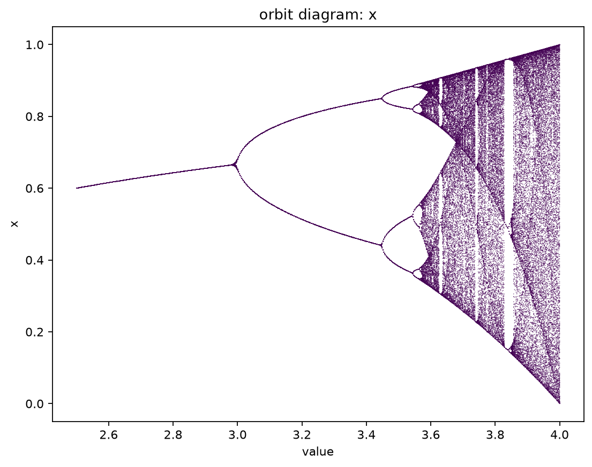
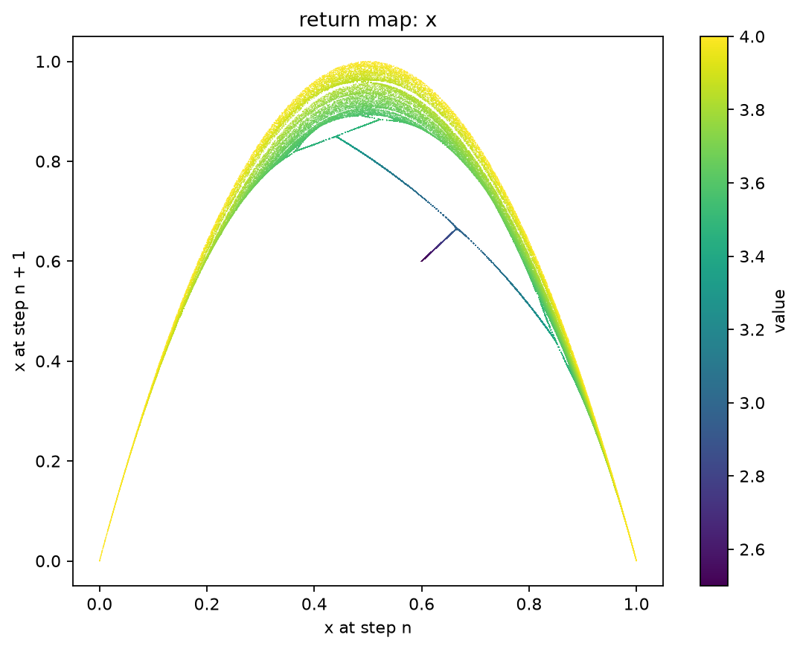
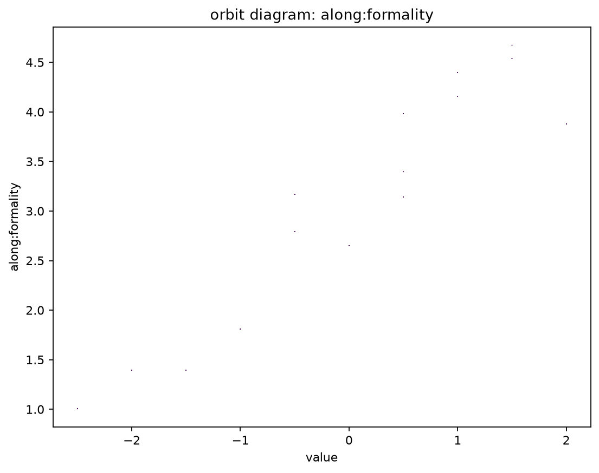
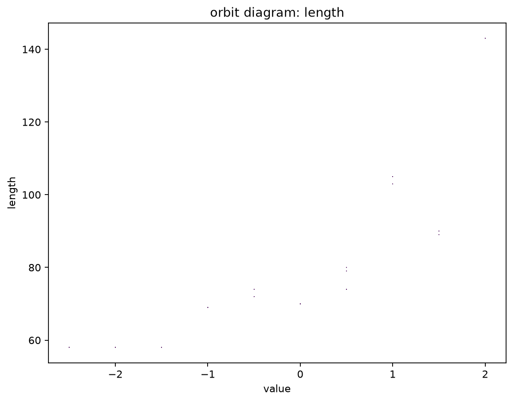
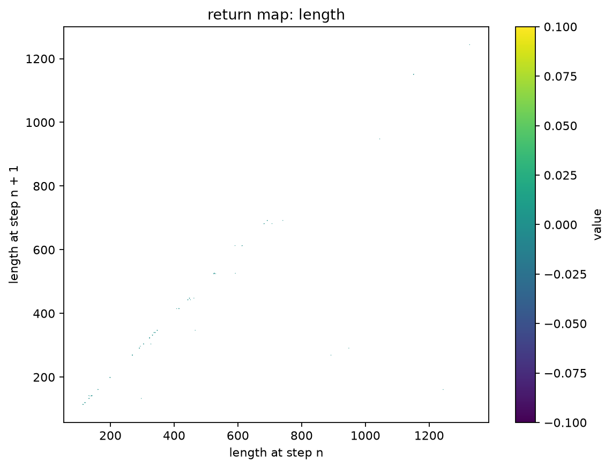
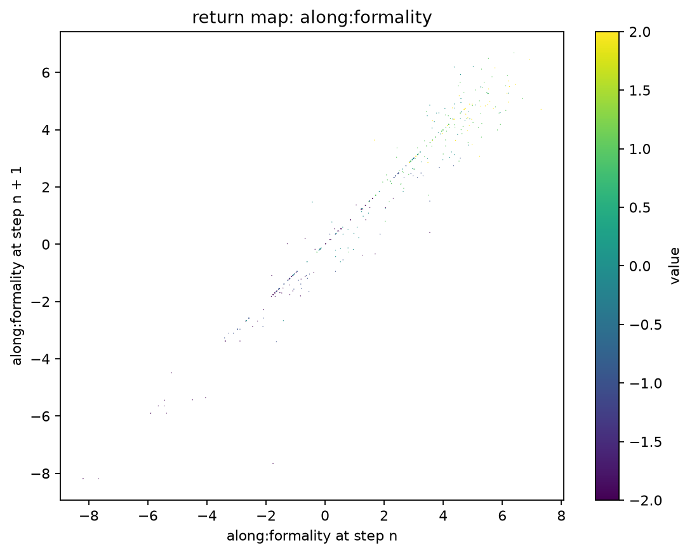
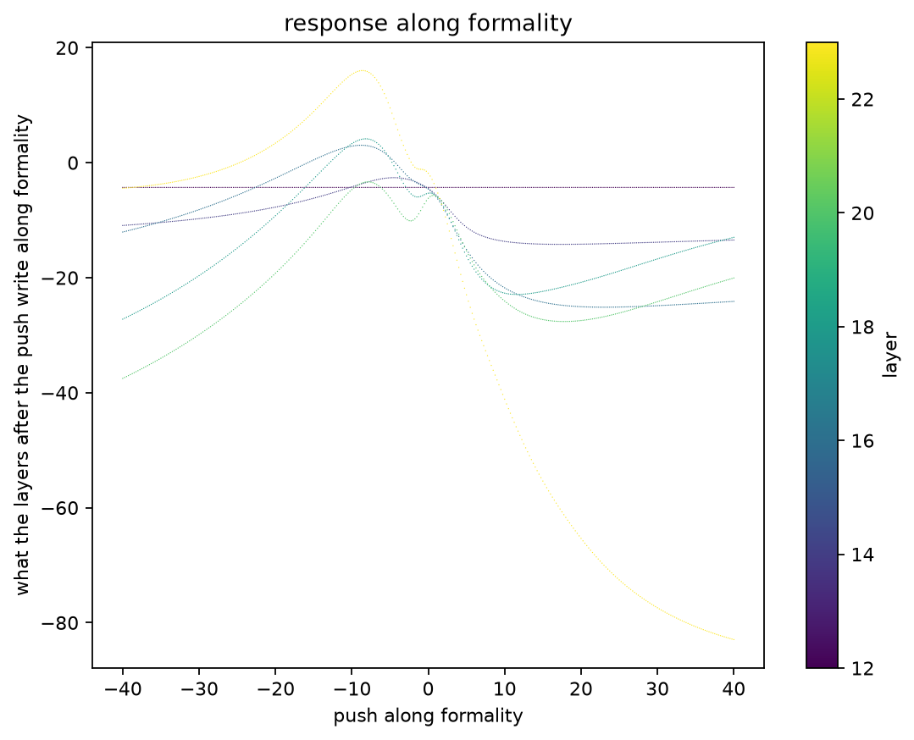
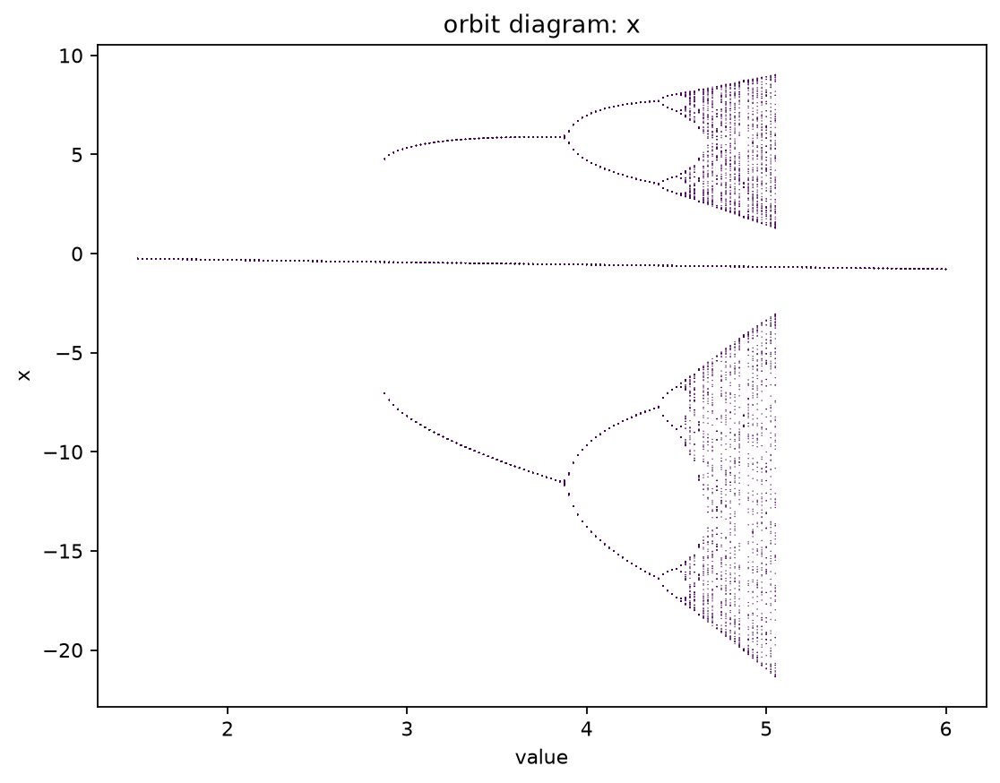

# universality

Does Feigenbaum universality apply to LLM feedback loops? The founding document is
[PROJECT.md](PROJECT.md); this file is how to run the code.

## Setup

Everything runs with [uv](https://docs.astral.sh/uv/).

    uv run uni gen "hello"

That one command installs everything and generates from the pinned model. The first run
downloads the checkpoint, about a gigabyte, into the Hugging Face cache. It prints the
text, its sha256, and each generated token with its log-probability.

The model, its revision, dtype, and generation limit are pinned in
[uni/pinned.toml](uni/pinned.toml), and nothing else in the code names them. Generation
runs on Metal, greedy at batch size one; the checkpoint's own sampling settings are
ignored. CPU is too slow for this work, so it is not an option.

## What a run's exit code means

Each code is its own answer rather than a generic failure, because what a reader does
about them differs.

| code | what happened |
|---|---|
| `0` | it did what was asked |
| `1` | the determinism gate ran and some case produced more than one hash |
| `2` | the command line did not parse: a flag this program does not have, or one it needs left out or given no value |
| `70` | a bug in this program: the traceback printed with it says where, and is worth reporting |
| `74` | the machine would not do the work: a full disk, a read-only volume, a path in the way, a checkpoint it cannot fetch |
| `78` | the command parsed, and the run it describes cannot be run: a file, a value, or a combination this program refuses |
| `79` | a sweep ran and some cell of it has no orbit, so it came up short of its grid |
| `141` | something downstream stopped reading, as `uni ... \| head` does — the run was told to stop, not refused |

`78` and `74` are the pair worth telling apart: the first is something you asked for, the
second is something about where you asked it. A loop running unattended can fix a `78` and
try again, while a `74` is not the command's to fix — an outage may clear, a disk will not — and
is where such a loop should stop.

With `--remote` the code is the one `uni` exited with on the host, so the table holds there
too — unless the trip itself fails, and then the code is ssh's or rsync's: `255` from ssh, and
rsync's own codes, one of which is `1`.

## Determinism

Every measurement in this project compares hashes of generated text, so the same input
must produce the same output every time. The gate checks that:

    uv run uni determinism --remote

It generates each case 100 times and prints every run's sha256, then a verdict per
case. It exits 1 if any case produced more than one hash. The cases are an ordinary
prompt, the empty prompt, and a prompt that fills the model's context limit with 16
tokens left over. `--runs` changes the count. A full run takes about 15 minutes, and
it has passed on the run host. Run it again when the model, torch, transformers, or
macOS on the run host changes; nothing else can change the result.

`uv run pytest` checks the same cases with 3 runs each, so the suite stays fast, and
also checks that a fresh process produces the same hash, since the command's runs all
share one process.

Hashes are only comparable within one machine. The run host and a dev Mac agree on
tokens and hashes but differ in the sixth decimal of the log-probabilities.

`tests/test_determinism.py` also holds a negative test, which shows the failure the
gate protects against. The same prompt, batched with a longer request and left-padded
with positions counted from the mask, gives log-probabilities that differ from batch
size one by up to about 1e-4. The greedy text survives that on a short prompt, but in
a long feedback loop a near-tie flips a token, and one flipped token turns an orbit
into noise. That is why the wrapper generates at batch size one and has no batch
setting.

## The loop

A template turns a state into a prompt, and the model's reply is the next state. Feeding
the reply back in, step after step, makes the model an iterated map:

    uv run uni loop --template rewrite --steps 20 --start "The lighthouse keeper climbed the stairs."

It prints the start as step 0 and every state after it, one per line, then writes the
trajectory to `trajectories/<name>.json` and prints the path. The file holds the start,
every state, the knob value, the template's text, and the pinned config, so the run can
be reproduced from the file alone. The name is a hash of those inputs and the step
count. Rerunning the same command rewrites the same file with the same bytes. With
`--remote` the file is written on the run host. The sync neither sends nor deletes
`trajectories/`, so each machine keeps its own. The directory is also gitignored.

The templates live in [uni/templates.toml](uni/templates.toml), each holding `{state}`
exactly once. `identity` asks for the state back unchanged, `empty` sends the state as
the whole prompt, `rewrite` asks for a rewrite, and `summarize` for a summary. The start may be
empty.

`--map` chooses which map is iterated, and defaults to the model. Whichever it is, the runner
only ever calls `step(state)` on it, so nothing below the command line knows there is more than
one. `--value` is that map's parameter: the knob's setting for the model, r for the logistic map
below, and the gain for the response map further down. Each map reads the flags that describe it
and refuses the rest, so a `--knob` carried over from a model run does not ride along unapplied on
an orbit of numbers.

## The logistic map

    uv run uni loop --map logistic --start 0.5 --steps 400 --value 3.5

`x -> r x (1 - x)`, the textbook map, iterated by the same runner, written to the same kind of
trajectory file, and read by the same `uni observe`. It is here because it is the one map whose
answer is known before the code runs: Feigenbaum's period doubling was published for it in 1978,
so an orbit of it is the fixture where a wrong answer is visible as a wrong answer rather than as
a result. Every brick in this repo has it as a second consumer, which is what keeps the bricks
from being shaped around the model.

    r = 2.8   period 1     r = 3.5   period 4     r = 3.9   no period in 1000 steps
    r = 3.2   period 2     r = 3.55  period 8

Those are what `uni observe` reports, exactly, on orbits from `--start 0.5`, given enough steps
to pass the transient and then close the cycle once: 155 at r = 2.8, 35 at 3.2, 33 at 3.5, and
289 at 3.55. The transient lengthens as the cascade goes on, so 2.8 is the slow one only until
3.55 overtakes it, and `--steps 400` covers every row that has a period. The r = 3.9 row is a
claim about a thousand steps and takes a thousand. Too few steps is not a wrong
answer — `uni observe` says it found no period in the steps it was given, and means it.

The orbit is periodic in the strict sense and not merely close to it: float64 lands on the cycle
and stays there, so the detector's exactness reports it with nothing rounded to help.

The states are text, like every other map's. A logistic state is the shortest text that reads
back as exactly its float, and a second spelling of a number the map holds is refused rather than
read: `--start 0.50` is told to write `0.5`. The detector compares the states themselves while the
`x` column compares their numbers, so a spelling the map would never write is one state to the
plot and two to the verdict — a fixed point reported as a transient it never had.

r is refused outside 0..4 and a state outside 0..1, which is not fussiness either: outside them
the orbit runs to -inf and then to nan, and a run of nans is a state that repeats, which a
detector would report as period 1. r has no default for the same reason — 0 is a legal r whose
orbit collapses to zero, so a forgotten `--value` would be answered `period 1` rather than asked
about.

This map costs no checkpoint. `uni loop --map logistic` imports no torch at all, refusals
included, which a test holds to.

## The steering knob

A knob is a number turned on the loop. The first one steers the model: it adds the
value times a fixed direction to the residual stream leaving one decoder layer, at every
position of every step.

    uv run uni loop --template rewrite --steps 20 --start "..." --knob formality --value 2

`--knob` names a direction in [uni/directions](uni/directions), or `none`; left off, the model
map runs unturned. `--value` defaults to 0 for this map, and at 0 the orbit is exactly the
unsteered one. Positive values
push the rewrites toward the direction's quality and negative values push away from it.
At layer 12, `formality` makes the rewrites clearly more formal by 2 and casual by -2. By
4 the rewrites drift away from the text they started from, and they keep drifting: a value
in the millions still generates, it just generates nothing worth reading. Only a value
large enough to stop the logits being numbers at all is refused, at the step it happens,
rather than written down as an orbit of real text. A value with no knob to turn is refused
before the checkpoint is read, rather than recorded as if it had steered.

A direction comes from a contrast, `uni/directions/<name>.toml`. A contrast is a
template, a layer, and pairs of replies to the same text, one toward the quality and
one away from it. Each reply is read as the model's own answer to the template, and the
direction is the mean over pairs of the difference in the layer's residual stream,
averaged over the reply's tokens. Derive it once:

    uv run uni direction formality

This writes `uni/directions/formality.json`, which holds the vector, a copy of the
contrast that produced it, and the checkpoint it was read from, and is committed. Every
trajectory steered by it records the direction's name, layer, and sha256, which is the
hash of the file itself: a direction file that has been edited by hand, or derived on a
different checkpoint than the one pinned, is refused. Re-derive when the contrast or the
checkpoint changes.

## Sweeps

One map run at every value on a grid, from every start, kept together:

    uv run uni sweep --remote --map logistic --grid 2.8:4.0:200 --start 0.5 --steps 400

`--grid FROM:TO:COUNT` names the values, `TO` included, and the ends are exactly the numbers
asked for rather than what the arithmetic lands near — a sweep to r = 4 is a sweep to the edge of
the logistic map's range, and one ulp past it is a cell the map refuses. `--start` is repeated
once per start. Everything else means what it means for `uni loop`.

`--starts NAME` runs a whole set of starts from [uni/starts.toml](uni/starts.toml): a passage cut
after each of a list of word counts, so the starts spread over how long a state is rather than
sitting wherever one typed sentence happens to. It can be repeated, and mixed with `--start`; the
typed starts come first, then each set in the order named. The sweep is named for the starts
themselves, so a set and the same starts typed out are one sweep, and editing a set is a new one.

A sweep runs each cell exactly once, so a grid or a set of starts that names one twice is refused
rather than run twice into one file, and so is a grid the map cannot take — every value is offered
to the map and to the knob before the first cell runs, because a sweep that dies two hundred cells
in dies again on every resume.

Two failures those checks cannot cover, both because a model's states are its own replies. A
state can grow until the rendered state leaves no room to generate, and a reply can fail to end
within the pinned `generation.max_new_tokens`, or within what room the context has left — which a
map refuses, because a reply a limit cut off is not the model's reply, and names the limit. Whether step 300 does either is knowable only by running to step
300. So a cell the map refuses **partway through its orbit** does not stop the sweep. The run says
so on that cell's line, carries on to the cells after it — which are
separate runs of a separate map, with nothing wrong with them — names every refused cell again at
the end, and exits non-zero. Nothing is written for a cell with no orbit: a sweep directory holds
trajectories and nothing else, so the cell simply stays pending and the next run tries it again,
which is what you want the moment whatever refused it is fixed. Were the failure recorded instead,
the cell would be marked done by a run that did not do it, and nothing would ever go back for it.

What makes that a statement about the cell rather than about the sweep is *what* was refused, not
how far the orbit got. A steering direction's layer, and the length of its vector, are fixed by
the direction and not by the setting, so an addition the checkpoint cannot take is one no cell
could have taken: the family is asked for a map before the manifest is written, so that sweep is
refused whole, with no token generated and no directory left behind to fill. A map that comes back
set to a value other than the one it was asked for says the same kind of thing about every cell,
but is found only by running one, so it stops the run where it is found. How early the orbit
stopped would be the wrong test for the same thing, because residual additions large enough to
overflow the model's arithmetic also refuse the first token, and *that* is a property of the
value the cell runs at.

Two things a refused cell does not get, and both are deliberate. It is not remembered: a rerun
runs it again, pays for its orbit again, and is refused again, so an unattended resume loop does
not converge — read the exit code, which is `79` when a sweep ran and came up short, distinct from
the `78` that says the command itself cannot be run. The two do not add up: a run that refused
some cells and was then stopped outright exits with whatever stopped it — `78`, `74`, or `141` —
because what ended it outranks how far it got, and its refusals are on stderr rather than in the
code. And the states it did produce are thrown away rather than written under their own shorter
name, which would put a file in the directory this sweep never named and no rerun would ever look
for. Both are the price of a sweep directory that holds finished orbits and nothing else;
`universality-sweep-81g` carries the question of whether a sweep should be able to say "tried and
cannot" somewhere.

The sweep writes `sweeps/<name>/`: one trajectory per cell, in the same format `uni loop` writes
and `uni observe` reads, beside a `sweep.json` naming the map, the values, the starts, and the
step count. The directory is a hash of exactly those, so rerunning the same command resumes the
same sweep, and changing any of them starts a different one.

It is resumable, and by construction rather than by bookkeeping. A trajectory's file name is a
hash of what fixes the orbit, all of which is known before the cell is run, so a cell is done
when its file is on disk — and `uni loop` already writes each file under a temporary name and
renames it into place, so a run killed part way leaves no half-written cell to mistake for a
finished one. The manifest records what the sweep *is* and never what it has finished: a count of
progress kept beside the files would be a second thing to believe, free to disagree with them.

    uv run uni sweep --remote --map logistic --grid 2.8:4.0:200 --start 0.5 --steps 400 --status

The same command with `--status` says how many cells are done and runs none of them — and writes
nothing, not even the sweep's own directory: a question that left something behind would be an
answer that had changed what it just measured. It costs no checkpoint either, because a map family
holds the pinned configuration rather than a loaded model and reads the checkpoint only when a
cell is actually run. A sweep is identified by what it is, so there is no way to ask about one you
cannot describe.

Sweeps are kept where trajectories are: written on the machine that ran them, gitignored, and
excluded from the `--remote` sync — which runs one way, this tree to the host, with `--delete`. So
a local sweep is never pushed and the host's own is never deleted, and each machine keeps its own.

## Observables and the period

A trajectory is read back from its file rather than re-run, so an observable thought of today
can be asked of an orbit recorded months ago:

    uv run uni observe trajectories/<name>.json

It prints the period first, which is read off the states alone and needs no model, and then one
row per step: a number for the state, then each observable. The state numbers count distinct
states in the order they first appeared, so a period-2 orbit reads `1 2 1 2` straight down the
column. Step 0 is the start, which was given rather than stepped into, so its row carries a
number and no readings.

What an orbit can be read for is decided by what its states are made of, so the columns differ
by map and nothing printing them asks which map it was. The character length of the state is the
one every map answers. An orbit of numbers is read for the numbers, under the column `x` — there
is nothing to derive, and the return map of such a map is the map itself drawn. A model's orbit
is read for the mean log-probability the model gives
the state it wrote (mean, not total, so it is not length under another name), and, for a run that
was steered, how far the state sits along the direction that steered it. The log-probability is
read with the knob at the setting the run recorded: the same model turned elsewhere is another
model, and scores the state differently. The projection is read with the knob off, because it is
read at the layer the knob writes to, and reading through the knob would add the same vector at
every step — a constant that says nothing about the state. An orbit written on a checkpoint other
than the one pinned now is refused, as is a direction that has changed since it steered the run:
every reading is in the units of the weights it was taken under.

The period is exact rather than estimated. The orbit of a deterministic map is exact about this: if a state comes back,
the state after it is the same state as last time, and so is every state after that, forever.
So one repeat fixes both numbers at once, and no window width or count of confirming cycles
enters into it. That the model's map is deterministic is what `uni determinism` establishes.

There are three things the detector can say, and only one of them carries a number:

- `period P, entered at step N` — the orbit came back and kept coming back for the rest of
  the data. Step 0 is the start, as `uni loop` prints it, so `N` also says how long the
  transient was.
- `no period: N steps examined and no state repeated, so any period is at least N` — nothing
  came back. At least, not longer: showing a period of P takes P + 1 states, so a window of N
  that shows no repeat leaves a period of exactly N standing. The detector will not guess which.
- `the state at step N came back P steps later, but step M is not the state P steps before it`
  — the orbit came back and then left the cycle, naming the step that broke it. That cannot
  happen to a map that is a function of its state, so it is reported as its own answer rather
  than filed as "no period", and it means `uni determinism` should be run before anything is
  read into the orbit.

`--burn-in N` passes over the first N steps before looking, for when an early transient is
already known and not wanted. It is rarely needed: the detector reports where the cycle began,
which is the same fact measured rather than assumed.

## The two pictures

    uv run uni plot sweeps/<name> --observable x --burn-in 200

Reads a persisted sweep and writes two figures under `figures/`. Nothing about either one asks
which map ran. The **return map** is the observable's sequence plotted against itself one step
later, which for a map whose states are numbers is the map itself drawn. The **orbit diagram** is
the same readings against the value they were taken at, which is the picture PROJECT.md's Rung 1
is about: period doubling is branches splitting as the value grows.

Both are the same kind of value — points with an x, a y, and a number that colours them — so
there is one drawing function rather than two to keep in step. The return map is coloured by the
value each orbit ran at, so a sweep of one value is one colour and a grid is a fan of them. The
orbit diagram is one colour, because the value is already its x axis.

`--burn-in N` keeps each cell from step N onward, which is where a picture wants a settled orbit
and not the transient that got there. It means exactly what it means to `uni observe`, which
counts the start as step 0 - so a period read off one command and a picture drawn by the other are
about the same states. Nothing has a reading for the start, so `--burn-in 0` and `--burn-in 1`
draw the same picture. A sweep that is still running is drawn from the cells
that are on disk, which is the point of persisting them one at a time; a sweep with nothing on
disk, or a burn-in that ate every step, is refused rather than written as an empty figure that
looks like an answer.

The figure files are named for what fixes the picture - the sweep, the observable, the burn-in -
so a picture says what it is of, and drawing the same sweep another way puts a new file beside the
old one rather than over it.

### The logistic cascade

    uv run uni sweep --map logistic --grid 2.5:4.0:600 --start 0.2 --start 0.7 --steps 400
    uv run uni plot sweeps/e84d01205c88ec92 --observable x --burn-in 200

This is the reference picture, and it is the textbook one. The single branch to r = 3; the first
split exactly at 3.0; the second at about 3.449; the third at about 3.544; the branches crowding
into the accumulation near 3.5699 and then the chaotic band; and inside the band the period-3
window at about 3.83, with its own miniature cascade. The start is 0.2 and 0.7 rather than 0.5,
because 0.5 is exactly the pre-image of the map's maximum: at r = 4 it lands on 1.0 and then on
0.0, and the whole right-hand edge of the picture would be a single dot at zero.

The return map of the same sweep is the family of parabolas, one per r, fanning up to the r = 4
one that touches 1.0. PROJECT.md asks of Rung 1 whether the return map has one smooth hump,
because that is the property the whole theory rests on. For this map it does, by construction —
which is what makes the logistic map the fixture: a wrong answer here is visible as a wrong
answer rather than as a result.

### The rewrite loop over the steering coefficient

The same two pictures for the map this project is actually about: the model rewriting its own
output, with the formality direction added to the residual stream at layer 12, swept over the
coefficient.

    uv run uni sweep --remote --map model --template rewrite --knob formality \
        --grid=-6:6:25 --start "The meeting moved to Thursday because the room was booked." --steps 30
    rsync --archive "$UNI_REMOTE_USER@$UNI_REMOTE_HOST:$UNI_REMOTE_DIR/sweeps/37e340c190aad178/" \
        sweeps/37e340c190aad178/
    uv run uni plot sweeps/37e340c190aad178 --observable along:formality --burn-in 10

The middle line is not decoration. The sweep ran on the host and its cells stay there - `sweeps/`
is excluded from the sync, and the sync has no leg coming back - so the directory has to be
brought home before anything here can draw it. Plotting is a local command by design: a figure
is an output this repo commits, and drawing one on the host puts it where no commit can reach
it, which is also why `figures/` is excluded from the sync rather than deleted by it. `uni plot
--remote` is refused for the same reason rather than left to draw somewhere unreachable and exit
0 - it is the one command that says where its answer lands. The sweep's name is the same on both
machines, because it is the hash of what the sweep is. There is no `uni fetch` doing the middle
line for you yet; it is filed as `universality-remote-lhh`.

**Only the middle of that grid is a map.** The sweep exits `79`, with 10 of its 25 cells written:
every coefficient from -2.5 to 2.0. At -3.0 and below, and at 2.5 and above, the model's reply to
its own rewrite does not end within the pinned 256 new tokens, and a reply the budget cut off is
not a state of this map, so those cells are refused rather than recorded. What fills the budget
there is not a long answer a larger budget would finish: at -3.0 it is "Cause the room was
booked!" repeated until the budget stops it, and at +6.0 a slide into or-chains and then into
repeating boilerplate in another language. The edge is sharp, too. The longest reply at 2.0 is 24
tokens, and at 2.5 every one is cut.

An earlier run of this sweep kept those cuts as states, and 446 of its 750 states sat on the
budget; its pictures showed wings that measured the ceiling. A trajectory now records that cut
replies are refused, so that run's orbits are not taken for this map's. The 10 cells both runs
wrote are identical, state for state.

The knob works. Where the settled state sits along the formality direction rises from about 1.0
at a coefficient of -2.5 to about 4.6 at 1.5, which is the knob doing what a knob should. At 2.0,
the last coefficient before replies stop ending, it falls back to 3.9.

What the picture does not show is a cascade. The periods are measured rather than eyeballed —
`uni observe` reports each one — and across the 10 cells they are 6 fixed points, a period 2 at
-0.5, 1.0 and 1.5, and a period 3 at 0.5. The cycles longer than one sit around the unsteered
point, not in a doubling sequence, and 0.5 apart on the knob is far too coarse a grid to call any
of it a bifurcation.

The return map says the same thing: the fixed points lie on the diagonal, and each cycle is a
handful of points mirrored across it. Rung 1 of PROJECT.md asks whether this map has one smooth
hump, because that is the shape the whole theory rests on. This is not that shape. A hump needs
states that move.

Read for the character length of the state instead, the sweep shows what the knob does to this
loop on the way to the edge. The informal side settles on one short sentence of 58 characters,
and on the formal side the settled state grows to 143 characters at 2.0, just before replies
stop ending at all.

What this sweep settles is therefore narrow and worth stating plainly: at this template, this
direction, this start, this step count and this resolution, the rewrite loop does not period
double where it is defined, which is between -2.5 and 2.0. It converges or cycles near zero.
Whether a finer grid inside that range, a longer run, more starts, or another knob would show
anything else is the next question, and it is the question Rung 1 exists to ask.

### The loops from many starts: is there a hump?

A sweep from one start shows where that start's orbit settles and nothing about the map around
it. Rung 1 asks for the map's shape, and a map's shape is only drawn where there are states, so
these sweeps hold the knob still and spread the starts instead: the two start sets, each a passage
cut at 1, 2, 3, 5, 8, 12, 18, 27, 40, 60, 90 and 130 words, 24 starts from 3 to 830 characters.

    uv run uni sweep --template summarize --knob none --grid 0:0:1 --starts harbor --starts memo --steps 6
    uv run uni plot sweeps/2ec2ab48ac42aa38 --observable length --burn-in 0
    uv run uni sweep --template rewrite --knob none --grid 0:0:1 --starts harbor --starts memo --steps 6
    uv run uni plot sweeps/d118c0eae9b434f2 --observable length --burn-in 0

**Summarize has no hump, and no one fixed point either.** Every one of its 23 orbits is a fixed
point by step 3, exactly - the same text, byte for byte, from then on - and 20 of them by step 2.
They are 23 *different* fixed points: no two starts settle on the same text, and their lengths run
from 114 to 1151 characters. The one cell refused is the memo cut at 12 words, whose summary does
not end within the 256-token budget. So the return map is the diagonal with a few transient
points off it, which is what a map looks like when nearly every state it writes is one it will
write again: a summary of a summary, to this model under greedy decoding, is the same summary.

**Rewrite is the same with a little more motion.** Of its 24 orbits, 18 are fixed points within
four steps - again 18 different ones, none shared - four are period 2 by step 4, and two have not
repeated in six steps. Its return map stays near the diagonal. The map draws the model's own
states, from step 1 on, and among those no step moves one of 60 characters or more by more than
37% (94 to 129, on its way to a fixed point); the one point far from the diagonal, 44 to 170,
belongs to a 28-character start that has still not settled at step 6. The first rewrite of a
start is another matter - the 12-word harbor start goes from 64 characters to 615 - which is the
model deciding what the text is, once.

Turning the knob does not change that. The same 24 starts under the formality direction, at five
coefficients inside the range where replies end:

    uv run uni sweep --template rewrite --knob formality --grid=-2:2:5 --starts harbor --starts memo --steps 6
    uv run uni plot sweeps/5417892e26309123 --observable along:formality --burn-in 0

| coefficient | written | refused | fixed points (all distinct) | period 2 | no repeat in 6 steps |
|---:|---:|---:|---:|---:|---:|
| -2.0 | 21 | 3 | 21 | 0 | 0 |
| -1.0 | 22 | 2 | 22 | 0 | 0 |
| 0.0 | 24 | 0 | 18 | 4 | 2 |
| 1.0 | 23 | 1 | 15 | 1 | 7 |
| 2.0 | 10 | 14 | 9 | 0 | 1 |

The sweep exits `79` with 100 of 120 cells written; every refusal is a reply that did not end
within the budget. The row at 0.0 is the unsteered sweep above over again, all 24 orbits text for
text, which is what adding zero times a direction should be. At every coefficient each start
that settles settles on a fixed point of its own, and no two starts share one: 85 fixed points,
84 different texts, because one start - the memo's first three words, "Following the review" -
is left exactly as it is at both 0.0 and 1.0. Steering toward
formal makes the orbits restless, seven of 23 still moving at step 6 at 1.0, but restless along
the diagonal rather than onto a common attractor.

Read along the direction that steers it, the return map is a band on the diagonal from -8 to 7,
tight where the coefficient is negative and loosening above 2 where the formal coefficients spread
it. There is no hump in it anywhere.

This is a result about the structure the theory needs, and it is negative. Period doubling is a
single attracting fixed point losing stability as a knob turns - its slope in the return map
passing through -1. These loops do not have a single attracting fixed point to lose. Each start
lands on a fixed point of its own within a step or two, so the set of fixed points is as large as
the set of starts, the slope along it is +1, and there is no hump for a slope to steepen on. A
content-preserving instruction under greedy decoding is close to idempotent: the model's first
answer is already the answer it would give to itself, steered or not.

What it points to is a loop that forgets where it started, which a loop carrying the whole text
forward cannot: a state small enough that the map is a smooth function of one number, as
PROJECT.md's continuous version of the loop has it. That is what the next section measures.

### A push and the model's answer to it: the hump

    uv run uni response --template rewrite --knob formality \
        --start "The meeting moved to Thursday because the room was booked." \
        --grid=-40:40:321 --layer 12 --layer 14 --layer 16 --layer 18 --layer 20 --layer 23

Here the state is a number rather than a text. The prompt is rendered once; the residual stream
leaving layer 12 is pushed by that number times the formality direction; and the reading is how
far the stream sits along the same direction at a later layer, averaged over the prompt, with no
token generated. Nothing is sampled, so the reading is a smooth function of the push - which no
number read off greedy text is, since the text holds still until one token overtakes another.

The push itself is taken back out of the reading. The residual connections carry it to every
later layer, so the stream's own projection is the push read back, 8.96 times the push (the
direction's squared length), a straight line whatever the model does. What is left is what the
layers after the push wrote in answer to it, and it is what `uni response` prints and draws.

The push is taken out token by token, before the average, and a push too large to take out is
refused rather than read. Every addition the stream makes while it holds the push rounds at the
push's size, so a large enough push rounds the model's writes out of the stream, and what is left
reads as a model that answers nothing. The command bounds that rounding from the push alone
before it runs a forward pass, refuses any cell it could move by a hundredth or more, and prints
the worst bound over the grid: 0.00051 for the run above, where a push of 1e12 would be 1.3e7.
Like `uni plot`, it runs here and refuses `--remote`: the figure it draws would stay on the host.

At layer 12 there is no answer - the curve is flat at -4.3035, float jitter aside, because
nothing after the push has run, which is also the check that the reading holds the push at all.
From layer 14 on the answer has a **hump**: pushed informal, the layers push back toward formal,
most strongly near -8.5; pushed further, less; pushed formal, they push back hard toward informal.
By layer 23, the last one, the curve changes direction exactly once on the 321-point grid, at a
maximum of 16.01 at -8.5, and falls on both sides all the way to -40 and 40. Layers 18 and 20 add
a small dip between -3 and 0, which layer 23 has smoothed into a shoulder.

Feigenbaum's 4.669 belongs to maps whose maximum is quadratic; a quartic top has its own constant,
about 7.28. On 97 points across -14.5 to -2.5, layer 23's top sits at -8.625, and a quartic fit
there gives a squared coefficient of -0.43, -0.40 and -0.40 on windows of 6, 4 and 2 either side,
against a fourth-power coefficient of 0.002 to 0.004. Within 2 of the top a parabola alone fits
to an rms of 0.05 on a range of 1.87, and how fast the curve falls away from the top goes as the
distance to the power 1.75 on the left and 2.09 on the right. The top is quadratic.

This is Rung 1 met, for a loop of this kind: one smooth maximum, of the order the theory needs. It
is a map in waiting rather than a loop yet - closing it means turning the answer back into the
next push, with a gain to turn, and finding the fixed point and its first flip, which is Rung 2.

### The loop closed: a gain, a fixed point, and the first flip

    uv run uni loop --map response --template rewrite --knob formality \
        --text "The meeting moved to Thursday because the room was booked." \
        --layer 23 --value 3 --start=-8.5000 --steps 40

`--map response` turns the answer back into the next push. The state is the push x. One step reads
the answer r(x) exactly as `uni response` does, and the next push is `gain * r(x) / |v|^2`, where
the gain is `--value`. Dividing by the direction's squared length, 8.96, puts the answer in the
units of the push, since a push of x reads back as x |v|^2 along the direction. So at gain 1 the
next push is exactly the push the answer amounts to, and the gain is PROJECT.md's feedback gain
made literal: how much of the answer is fed back. `uni sweep --map response` sweeps the gain.

The state is the push written to four decimals, `-8.5000` and not `-8.5`, and a start spelled any
other way is refused with the spelling to use. A push held to every bit of a float64 is more than
the model can tell apart: the answer is float32, and so is the push on its way into the stream.
Measured at gains 1 to 12, a settled orbit's float64 states spread over 2e-7 to 7e-6, and the
detector counted that spread as cycles of three and six and as real periods doubled. Four decimals
is fourteen times the widest spread. Even so, near an attractor an orbit can flicker between two
neighbouring spellings, a cycle whose points are 0.0001 to 0.0007 apart, which the exact detector
reports as a period. Such a period is not one this section counts; the orbit diagrams and the
slope below do not see it.

    uv run uni fixed --map response --template rewrite --knob formality \
        --text "The meeting moved to Thursday because the room was booked." \
        --layer 23 --grid 1:20:20 --bracket=-3:0 --step 0.05

`uni fixed` answers Rung 2 off the map itself rather than off an orbit. At each value it bisects
for the state the map carries least far, between two states it carries in opposite directions,
and reads the map's slope there across the states `--step` either side. A fixed point gives way
to a period-2 orbit exactly where that slope passes through -1. On the logistic map it returns
x* = 1 - 1/r and a slope of 2 - r to the last digit, and the crossing at r = 3.

The response map has one fixed point between -3 and 0 at every positive gain, and it moves from
-0.18 at gain 1 to -1.76 at gain 20. Its slope is -0.14 at gain 1, never steeper than -0.25 up to
gain 10, and then it falls: -0.61 at 12, -1.10 at 14, -2.72 at 20. It passes through -1 at gain
**13.59**. On a grid of 0.02 across 13.4 to 13.8 the crossing lands at 13.60, 13.60 and 13.58 for
steps of 0.02, 0.05 and 0.1. A four-decimal state makes the slope uncertain by 0.005, and the slope
changes by 0.25 per unit of gain there, so mu_1 = 13.59 +- 0.02. It never passes through +1: the
fixed point is not born or destroyed on this range, only destabilised.

FLIP_SWEEP_PARAGRAPH

That flip is not the first thing this loop does, though. Swept from 1.5 to 6 from two starts, the
top of the hump (-8.5000) and zero:

    uv run uni sweep --map response --template rewrite --knob formality \
        --text "The meeting moved to Thursday because the room was booked." \
        --layer 23 --grid 1.5:6:181 --start=-8.5000 --start=0.0000 --steps 400
    uv run uni plot sweeps/d503da82b73fe909 --observable x --burn-in 200

The fixed point runs straight through the picture, stable throughout. Beside it, from gain 2.875,
there is a second attractor: a period-2 orbit through the top of the hump, which appears already
12 wide, between 4.8 and -7.0, rather than growing out of anything. At gain 2.85 the orbit from the
top still falls onto the fixed point, and at 2.875 it does not. Its birth is therefore not a flip of
the fixed point, whose slope at that gain is -0.24. The start decides which attractor an orbit
reaches: from zero, every orbit on this range ends at the fixed point.

That second attractor then does exactly what a unimodal map's cascade does. It doubles to period
4 between gains 3.85 and 3.9, where each point has split in two by 0.95, and to period 8 between
4.375 and 4.425, split by 0.36. Just below each doubling the orbit settles slowly, so 200 steps
leave splits of a few thousandths that are not yet the cycle's own. By about 4.55 it no longer
repeats within 200 steps, and between 5.05 and 5.075 it vanishes: from there on, the orbit from
the top falls onto the fixed point too. Measuring those doublings to more than a grid step, and
their ratios against 4.669, is Rung 3 (`universality-rung3-sbn`). It needs a period read at a
resolution rather than exactly, for the flicker described above.

This is Rung 2 met: the fixed point is found, its slope is measured across the gain, and it gives
way at mu_1 = 13.59 +- 0.02, with the orbits splitting where the slope says they must. What this
loop adds to PROJECT.md is a coexisting attractor with its own cascade, reached from the top of the
hump long before the fixed point flips. In one dimension that is the only kind of "different
bifurcation first" there can be.

## Running on the experiment host

Every `uni` command accepts `--remote`. With it, this working tree, uncommitted edits
included, is mirrored to a host with rsync and the same command runs there over ssh,
streaming its output back. Without it, the command runs here.

The host is described only by three variables, read from a gitignored `.env` at the
repo root. Copy the example and fill it in:

    cp .env.example .env

| Variable          | Meaning                                              |
| ----------------- | ---------------------------------------------------- |
| `UNI_REMOTE_HOST` | Hostname or ssh config alias of the host             |
| `UNI_REMOTE_USER` | The user to ssh as                                   |
| `UNI_REMOTE_DIR`  | Absolute path on the host to mirror the tree into, plain characters only |

A real environment variable overrides the file. Run `--remote` from inside the checkout;
the tree that is mirrored is the one git sees from where you stand. The host needs key-based ssh access,
`rsync`, and `uv` on the PATH that a non-interactive ssh command sees.

    uv run uni host --remote

The repo is public. No hostname, user, or ssh target belongs in the tracked tree.
`tests/test_no_identity.py` fails the suite if a tracked file contains an ssh target, a
`.local` name, a private IPv4 address, or any value from your own `.env`. That last
check is the one that knows your host; run the suite with your `.env` in place.

## Tests

    uv run pytest
